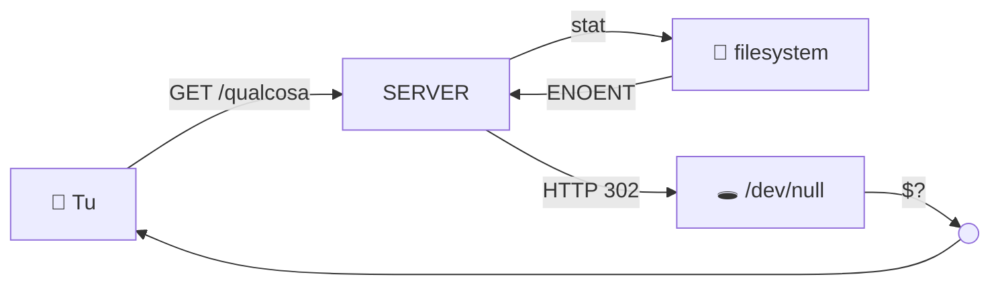

---
layout: post-index
title: "404: Vuoto spinto"
description: "Pagina non trovata nel tessuto dello spaziotempo"
permalink: /404.html
mermaid: true
---  



```bash
$ curl -I {{ site.url }}/questa-pagina-non-esiste
HTTP/2 404
server: cloudflare
x-cosmic-ray: probabilmente un neutrino ha flippato un bit

$ echo "dov'è finita la pagina?" > /dev/null
$ echo $?
0  # zero tracce, zero errori, zero tutto — come l'energia oscura
```

La pagina che hai richiesto non esiste. Non è mai esistita. O forse sì, ma solo in uno stato quantistico che è collassato nel momento in cui hai premuto Invio.

Qui non c'è nulla. Il vuoto. Lo zero assoluto. Un buco nero che ha inghiottito il contenuto e non c'è radiazione di Hawking che tenga. 

Se sei arrivato qui da un link interno, è colpa mia: [apri una issue](https://github.com/{{ site.repository }}/issues) e prometto di fixarla prima che l'universo raggiunga lo zero termico.

Altrimenti, la [home page](/) è ancora lì, integra, misurabile, deterministicamente accessibile e il gatto di Schrödinger è ancora vivo.