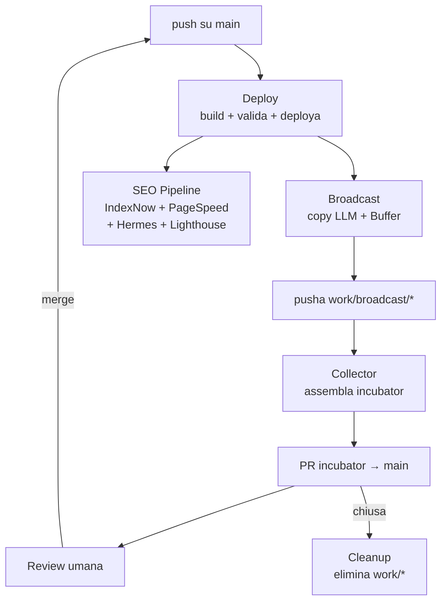

Nell'articolo precedente ho raccontato [come ho insegnato al mio blog a farsi trovare](), costruendo una pipeline di SEO auditing che parte da sola a ogni deploy. Era il primo tassello di un disegno più ampio.

Quello che non avevo ancora raccontato è che quella pipeline non è sola. È solo uno dei cinque workflow GitHub Actions che, insieme, formano una specie di **fabbrica automatica** che gestisce l'intero ciclo di vita di un articolo: dalla validazione pre-pubblicazione fino alla promozione social, passando per la raccolta ordinata dei contributi automatici in pull request pronte per la review umana.

E siccome sono un ingegnere che si diverte a sporcarsi le mani, oggi apro il cofano e vi mostro come funziona il tutto.

<!-- IMMAGINE: architettura-cinque-workflow.png — Diagramma dei 5 workflow con frecce: Deploy → Broadcast, Deploy → SEO Pipeline, work/* push → Collector PR, PR chiusa → Cleanup -->



Il flusso è questo:

<!-- IMMAGINE: flusso-workflow-sequence.png — Diagramma di sequenza: push su main → Deploy → (Broadcast ∥ SEO Pipeline) → work/* push → Collector → PR su main -->


Ma veniamo al sodo. Vi racconto i pezzi più interessanti di ciascun workflow, quelli dove ho sudato un po' la camicia.

---

## Workflow primario: build, valida, deploya

Il deploy parte a ogni push su `main`. Sulle pull request aperte verso `main`, il workflow builda e valida — ma non deploya, perché le preview deploy le gestisce già Cloudflare Pages in autonomia. La parte scontata è il build Jekyll in Docker e il deploy con Wrangler. La parte divertente è la validazione pre-deploy.

### Validazione immagini: niente link rotti, niente deploy

Prima di mandare online il sito, il workflow cerca tutte le immagini referenziate nei post modificati e verifica che i file esistano davvero su disco. Se manca anche una sola immagine, il deploy si blocca.

La parte più subdola è che le immagini possono essere referenziate in quattro modi diversi, a seconda di come Jekyll e Cloudinary le consumano:

```bash
# 1. Immagine hero (frontmatter master:)
grep -oP 'master:\s*\K/assets/images/\S+' "$post"

# 2. Overlay image (frontmatter header.overlay_image)
grep -oP 'overlay_image:\s*\K/assets/images/\S+' "$post"

# 3. Tag Liquid  (immagini nel corpo)
grep -oP 'cloudinary.*?/assets/images/[^"% ]+' "$post" | grep -oP '/assets/images/\S+'

# 4. Markdown standard 
grep -oP '!\[.*?\]\(/assets/images/[^)]+' "$post" | grep -oP '/assets/images/[^)]+'
```

Quattro sintassi diverse, quattro `grep` con regex diverse. Brutto ma funziona. E se una di queste referenze punta a un file che non esiste, il deploy viene fermato con un messaggio chiaro.

### Validazione link interni: il bug che (non) c'era

Poi c'è la validazione dei link interni. L'idea è semplice: prendi tutti i `[testo](/path/interno)` dal markdown, li normalizzi nel percorso corrispondente dentro `_site/` e verifichi che il file HTML esista.

<!-- IMMAGINE: validazione-link-interni.png — Screenshot del log di una validazione che trova un link rotto -->

La normalizzazione è un piccolo gioiello di bash:

```bash
link_path="_site${link%/}"
if [ -d "$link_path" ]; then
  link_path="${link_path}/index.html"
elif [ -f "${link_path}.html" ]; then
  link_path="${link_path}.html"
fi
if [ ! -f "$link_path" ]; then
  echo "  ❌ LINK ROTTO: ${link}"
fi
```

Traduco: rimuovo il trailing slash, poi provo `/index.html` (perché Jekyll con permalink `/:categoria/:titolo/` genera sempre directory). Se non esiste, provo `.html` come fallback. Se non esiste nessuno dei due, blocco il deploy.

C'era un bug, però. La prima versione usava questa condizione:

```bash
if [ ! -f "$link_path" ] && [ ! -d "$(dirname "$link_path")" ]; then
```

Con l'`&&`, il link veniva segnalato rotto **solo se mancavano SIA il file che la directory padre**. Se la directory esisteva ma `index.html` no (perché il post non era ancora stato scritto o aveva uno slug sbagliato), il controllo passava silenziosamente. Un 404 garantito per il lettore.

Ora è stato corretto: basta che il file non esista, e il deploy si ferma — esattamente come per le immagini mancanti.

---

## Broadcast social: il social media manager che non ho

Questo è forse il workflow di cui vado più orgoglioso. L'idea: quando pubblico un articolo, genero automaticamente i copy per LinkedIn e Mastodon con un LLM, creo le bozze in Buffer e committo il tutto in un branch `work/broadcast/*` che finirà nella PR dell'incubator.

### Il selettore di post

Prima di tutto, il workflow deve capire quali post broadcastare. Non tutti i post vanno sui social (alcuni sono troppo tecnici, altri sono WIP). La logica è nella bash di selezione:

```bash
find _posts -name '*.md' -o -name '*.Rmd' | sort > /tmp/all_posts.txt
while read -r post; do
  # Salta se broadcast: false
  grep -q 'broadcast:\s*false' "$post" && continue
  # Salta se già inviato (sent: true)
  grep -q 'sent:\s*true' "$post" && continue
  # Salta se già presente in un work branch con sent: true
  # ...logica di fetch da work/broadcast/{cat}-{slug}...
  # Includi se ha broadcast: nel frontmatter
  grep -q 'broadcast:' "$post" && echo "$post" >> /tmp/posts_to_broadcast.txt
done < /tmp/all_posts.txt
```

Il criterio è: il post deve avere `broadcast:` nel frontmatter, non deve essere `false`, non deve essere già stato inviato (né sul branch corrente né in un work branch). In questo modo ogni post viene broadcastato una volta sola, anche se il workflow riparte.

### Il generatore di copy via LLM

Il cuore del broadcast è [`_scripts/broadcast.py`](https://github.com/theclue/gabrielebaldassarre.com/blob/main/_scripts/broadcast.py), uno script Python che:

1. **Estrae le informazioni** dal post (titolo, estratto, primi 1500 caratteri di corpo, ripuliti da LaTeX e markdown)
2. **Chiama GitHub Models** (GPT-4o via API) con un prompt che descrive la mia personalità: _"Sei un ingegnere italiano che scrive di fisica, automazione e data science... non ti prendi troppo sul serio. Un po' di autoironia ogni tanto ci sta."_
3. **Riceve il copy** in JSON con testi separati per LinkedIn (max 800 caratteri, domanda in bold, hashtag inline) e Mastodon (max 390 caratteri, asciutto, prima persona)
4. **Crea le bozze in Buffer** via GraphQL API, con le immagini ritagliate da Cloudinary nelle dimensioni corrette per ciascun social (1200×627 per LinkedIn, 1200×675 per Mastodon)
5. **Marca il post come `sent: true`** nel frontmatter, così non viene riprocessato

<!-- IMMAGINE: buffer-drafts.png — Schermata di Buffer con le bozze create automaticamente dal workflow -->

La parte più delicata è stata la gestione dei fallback: se l'immagine non è ancora in cache Cloudinary, Buffer la rifiuta. Lo script ritenta fino a 5 volte con warmup progressivo, e come ultima spiaggia crea la bozza senza immagine. LinkedIn, poi, riceve **due** bozze: una con immagine e una senza (link post nativo), così posso scegliere quale pubblicare.

### Il commit automatico su work branch

Dopo il broadcast, le modifiche al frontmatter (`sent: true`) vengono committate in un branch `work/broadcast/{categoria}-{slug}`. Qui c'è un dettaglio importante: prima di committare, il workflow fa un `git merge origin/main` per allinearsi. Se il merge fallisce per conflitti, abortisce e ricrea il branch pulito da `origin/main` — niente conflict marker committati per sbaglio:

```bash
if git ls-remote --heads origin "$wbranch" | grep -q "$wbranch"; then
  git checkout -B "$wbranch" "origin/$wbranch"
  if ! git merge origin/main --no-edit -m "broadcast: refresh from main"; then
    echo "  Conflitto merge — ricreo da main"
    git merge --abort
    git checkout -B "$wbranch" origin/main
  fi
else
  git checkout -B "$wbranch" origin/main
fi
```

E al momento del push, se il branch esiste già uso `--force-with-lease` per evitare di sovrascrivere cambiamenti altrui; se è nuovo, un push semplice. Dopo il push, il collector viene triggerato esplicitamente via `gh workflow run` — perché il `GITHUB_TOKEN` standard non attiva altri workflow in cascata.

---

## SEO Pipeline: quattro audit in parallelo

Ne ho già parlato nell'articolo precedente, ma qui voglio evidenziare la struttura a job paralleli. Il workflow ha quattro job indipendenti che partono simultaneamente:

```yaml
jobs:
  indexnow:     # Notifica motori di ricerca
  pagespeed:    # Google PageSpeed Insights API
  hermes-seo:   # Hermes SEO Audit
  lighthouse:   # Lighthouse CI headless
```

Ognuno ha la sua logica di `if` per saltare se non ci sono URL da processare, e ognuno può fallire indipendentemente senza bloccare gli altri. Lighthouse, in particolare, ha `continue-on-error: true` perché è puramente informativo.

Il job IndexNow è una chicca: notifica Bing, Yandex e gli altri motori che supportano il protocollo con una singola POST:

```bash
curl -s -X POST "https://api.indexnow.org/indexnow" \
  -H "Content-Type: application/json; charset=utf-8" \
  -d "{\"host\": \"gabrielebaldassarre.com\", \"key\": \"$KEY\", \"urlList\": $URLS}"
```

La key è hardcoded nel workflow perché IndexNow funziona così: metti un file `.txt` nella root del sito con la chiave, e poi la usi nelle chiamate API. Niente secret, niente autenticazione complessa.

<!-- IMMAGINE: pagespeed-output.png — Output del job PageSpeed Insights con le percentuali mobile/desktop -->

---

## Collector: il raccoglitore automatico

Questo è il workflow che chiude il cerchio. Ogni volta che un workflow automatico (broadcast, o in futuro anche la SEO correttiva del blocco 3) pusha su un branch `work/*`, il collector si attiva e:

1. **Fetcha tutti** i branch `work/*` dal remote
2. **Preserva `incubator`** se esiste già (rispettando eventuali rebase manuali), altrimenti lo crea da `main`
3. **Mergia uno a uno** tutti i branch `work/*` in `incubator` con `--no-ff`
4. **Se c'è conflitto**, fa `git merge --abort` e salta quel branch
5. **Pusha forzatamente** `incubator`
6. **Crea o aggiorna una PR** su GitHub con un body dettagliato

Il body della PR è un capolavoro di chiarezza operativa: include la lista dei branch mergiati e di quelli in conflitto, il dettaglio delle modifiche per ogni post (con titolo estratto dal frontmatter), la commit history e il diff completo collassato in un `<details>`. In più, istruzioni in italiano su come rigettare le modifiche (cancellare il work branch, rebase interattivo o cancellare tutto).

```bash
echo '### Come rigettare modifiche'
echo ''
echo '**Opzione 1 — cancella una work branch:**'
echo '```bash'
echo 'git push origin --delete work/{pipeline}/{categoria}-{slug}'
echo '```'
```

La PR diventa così il punto di controllo umano prima che le modifiche automatiche arrivino su `main`. Io apro la PR, guardo cosa è cambiato, e decido se mergiare, modificare o cestinare.

<!-- IMMAGINE: collector-pr-body.png — Screenshot del body della PR creata dal collector con la lista dei branch e il diff -->

---

## Cosa ho imparato (e cosa no)

Costruire questa fabbrica mi ha insegnato tre cose:

1. **GitHub Actions è sorprendentemente potente.** Con bash, Python e un po' di YAML si può orchestrare praticamente qualsiasi flusso di automazione, senza servizi esterni.
2. **L'idempotenza è tutto.** Ogni workflow deve poter ripartire senza fare danni. Il `sent: true` nel frontmatter, i work branch, il merge con abort e fallback su `origin/main`: sono tutti accorgimenti per garantire che un rerun non crei disastri.
3. **Il controllo umano resta fondamentale.** Per quanto mi diverta ad automatizzare, la PR dell'incubator è lì proprio per ricordarmi che l'ultima parola deve restare a me. L'automazione propone, l'umano dispone.

---

## L'audit: dieci bug trovati, dieci bug risolti

Dopo aver scritto questa fabbrica, ho fatto un giro di revisione sistematico dei cinque workflow. Ne sono emersi dieci problemi, dalla gravità bloccante alla cosmetica. Eccoli, risolti uno a uno.

### 🔴 Quelli che rompevano cose

**Il push silenzioso.** Quando il broadcast pusha sui branch `work/broadcast/*` usando il `GITHUB_TOKEN` integrato, GitHub — giustamente — non triggera altri workflow per evitare catene infinite. Risultato: il collector non partiva mai, e la PR rimaneva vuota. Risolto aggiungendo uno step esplicito di `gh workflow run collect-incubator-pr.yml` dopo il push.

**Il merge che ingoiava i conflitti.** `git merge origin/main || true` era troppo permissivo: se il merge falliva, i conflict marker (`<<<<<<<`, `=======`) restavano nel file e venivano committati. Ora il merge fallito fa `git merge --abort` e ricrea il branch pulito da `origin/main`.

### 🟠 Quelli che vanificavano il lavoro

**Il collector sovrascriveva i rebase manuali.** `git checkout -B incubator origin/main` distruggeva qualsiasi rebase o amend fatto a mano su `incubator`. Ora il collector preserva `incubator` se esiste già, facendo rebase su `origin/main` invece di ricrearlo da zero.

**I link rotti erano invisibili.** La validazione link aveva due problemi: la normalizzazione assumeva che solo i percorsi con trailing slash fossero directory, ma Jekyll con permalink `/:categoria/:titolo/` genera *sempre* directory con `index.html`. E anche quando trovava un link rotto, non bloccava il deploy. Ora la normalizzazione prova prima `/index.html` (directory permalink) e poi `.html` (fallback), e i link rotti bloccano il deploy esattamente come le immagini mancanti.

### 🟡 Quelli che creavano disordine

**Race condition sui work branch.** Broadcast e collector operavano sugli stessi branch ma con concurrency group separati. Ora condividono un unico `group: work-pipelines`.

**Accumulo infinito di work branch.** Dopo la chiusura della PR, i branch `work/*` restavano lì. Un nuovo workflow `cleanup-work-branches.yml` li elimina automaticamente quando la PR incubator viene chiusa.

**Preview deploy duplicato su PR.** Il Deploy step eseguiva `wrangler pages deploy` anche sulle pull request, duplicando le preview deploy già gestite da Cloudflare Pages. Ora il deploy ha `if: github.event_name != 'pull_request'`: su PR builda e valida, ma deploya solo al merge su `main`.

### 🟢 Quelli che davano fastidio

**`.Rmd` causava timeout.** I file `.Rmd` triggeravano il workflow ma il knitting Knitr non era incluso nello step, causando build lentissime o timeout. Tolto `.Rmd` dai path trigger (il knitting lo faccio in locale).

**`HEAD~1` ballerino dopo il merge.** La SEO pipeline usava `git diff HEAD~1 HEAD` per trovare i post cambiati. Ma quando parte via `workflow_run`, HEAD può essere già avanzato se un'altra PR è stata mergiata nel frattempo. Risolto con checkout al commit esatto che ha triggerato il deploy (`ref: ${{ github.event.workflow_run.head_sha }}`), con `fetch-depth: 2` per avere anche il genitore.

**Checkout fantasma.** Broadcast e SEO pipeline facevano checkout su HEAD del branch di default, non sul commit specifico del deploy. Stesso fix del punto precedente, applicato a tutti e 4 i workflow.

---

Il codice completo, con tutte le correzioni, è su GitHub:

→ [github.com/theclue/gabrielebaldassarre.com/.github/workflows/](https://github.com/theclue/gabrielebaldassarre.com/tree/main/.github/workflows)

<!-- IMMAGINE: workflow-runs.png — Schermata delle GitHub Actions con tutti i workflow in esecuzione in sequenza -->

---

*Questo è il secondo articolo della serie sull'automazione del blog. Il primo, sulla SEO pipeline, lo trovate [qui](). Il terzo, sull'applicazione automatica delle migliorie SEO via LLM, è in lavorazione.*
