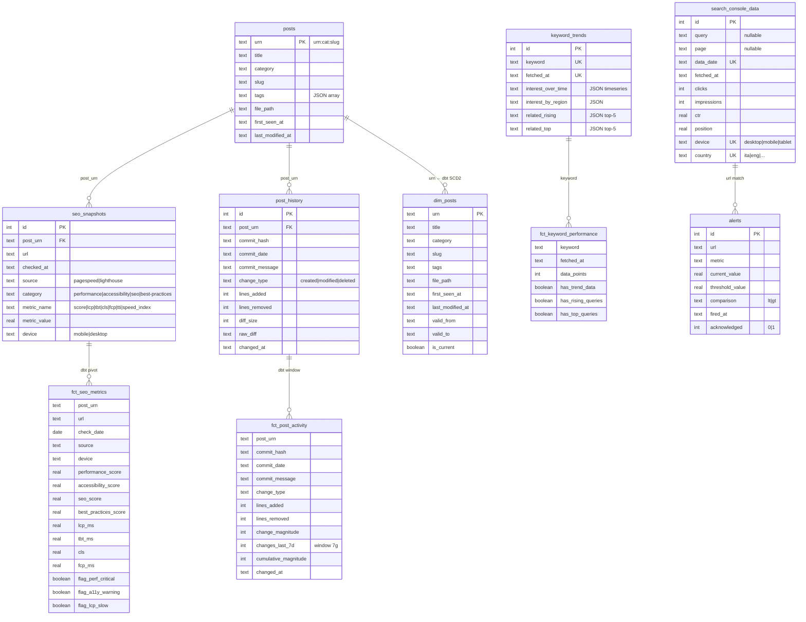

Nella  abbiamo costruito il **blocco 1** della pipeline SEO: il supporto all'autorialità. A ogni deploy, un workflow Github andava ad analizzare in ottica SEO i post nuovi o modificati tramite (individuati mediante `git diff`) e per ognuno di essi interrogava Lighthouse, PageSpeed Insights e IndexNow, segnalando potenziali problemi e fornendo indicazioni. Funziona. Ma è un'istantanea. Un controllo puntuale, una tantum. Un supporto alla fase di autorialità, appunto.

Quello che mancava era la *dinamica* del sistema, la sua **dimensione temporale**.

Il SEO non è un esame che passi una volta e sei a posto. È un ecosistema vitale: i contenuti invecchiano, le keyword cambiano trend, Google aggiorna l'algoritmo, i crawler AI iniziano a citarti (o smettono...ci torneremo). In generale, come ho detto altrove, evito che l'ansia da prestazione mi rovini il piacere della scrittura. Tuttavia, è innegabile, visitatori sul blog e commenti agli articoli sono la benzina motivazionale di chi ama la divulgazione e senza monitoraggio, senza la più vaga idea  di _cosa_ stia dentro e fuori il tuo blog, finisci presto in riserva.

Così è nato il **blocco 2**: il monitoraggio SEO, appunto. In _free tier_, tanto per cambiare.

--

<!-- image_placeholder: role="diagram" context="architecture" caption="Architettura del blocco 2: flusso dati da Google Trends, Search Console, PageSpeed e Lighthouse attraverso R2 (data lake) e dbt fino a D1 (DWH), con generazione di report mensile e alert" -->

## Architettura: da zero a data lake in tre mosse

Il blocco 2 non è collegato al blocco 1, che scattava andando a fare le pulci ai post nuovi e modificati. È un **workflow indipendente** di buon, vecchio , schedulato ogni lunedì alle 8:00 del mattino che:

1. **Raccoglie** dati dal mondo esterno (Google Trends, Search Console)
2. **Consolida** i dati già prodotti dal blocco 1 (PageSpeed, Lighthouse) in un archivio permanente
3. **Trasforma** i dati grezzi in un piccolo datawarehouse
4. **Allerta** se qualcosa supera le soglie
5. **Produce** un report mensile

Il tutto poggia su due servizi Cloudflare:

* **R2** (object storage): il Data Lake.
* **D1** (serverless SQLite): il DWH.

Perché Cloudflare e non, chessò, un PostgreSQL su Railway, o uno qualsiasi dei mille mila strumenti disponibili sui provider cloud maggiori, come AWS, GCP o Azure?

Diversi motivi:

1. Il free tier di Cloudflare è _davvero_ generoso per un blog personale — ci sto dentro di tre ordini di grandezza
2. I servizi Cloudflare sono, in genere, molto semplici da configurare. Nel caso specifico, mi sembrava esagerato preparare un ambiente `terraform` per questo setup e la CLI di cloudflare, ovvero `wrangler`, si è dimostrata intuitiva, immediata e facilmente adattabile a Github Actions.
3. L'inteto blog è già su Cloudflare Pages, quindi tutto l'ecosistema è co-locato, garantendomi zero latenza di rete tra R2 e D1 quando si fanno operazioni di ETL. Questo più a valore di _proof of concept_, per la verità, dato i numeri più che esigui mossi da un banale blog di provincia.

In generale, comunque, avevo voglia di sperimentare con i servizi Cloudflare che, appunto, sono spesso bistrattati a favore dei soliti tre _pezzi grossi_ del cloud e che, invece, a mio parere sono sorprendentemente adatti per diverse classi di casi d'uso, a una frazione del costo e con molto meno complessità di deploy.

Ma sto divagando. Dove eravamo rimasti?

---

## Step 1: preparare l'infrastruttura Cloudflare

Prima di scrivere una riga di Python, prepariamo due bei barili dove buttare i dati. Cloudflare mette a disposizione due servizi perfetti per un data lake da quattro soldi (nel senso che costa pocoa): **R2** per l'object storage e **D1** per il database SQLite serverless. Dome detto, la CLI  `wrangler` è stata una scoperta davvero piacevole. Installiamolo, tanto per cominciare:

```bash
npm install -g wrangler
wrangler login
```

Fatto. Ora possiamo creare tutto ciò che ci serve.

### R2: il data lake

R2 è un object storage compatibile con l'API S3 di AWS. Non è un filesystem, non è un database: è un posto dove butti oggetti (nel nostro caso, JSON) e li recuperi quando ti servono, pagando solo per ciò che consumi. Qualsiasi libreria o tool che sa parlare S3 — `boto3`, `awscli`, `rclone` — funziona con R2 senza modifiche.

Creare un bucket è una riga:

```bash
wrangler r2 bucket create unfantasticobucket-seo --location weur
```

<!-- image_placeholder: role="screenshot" context="step" caption="Creazione del bucket R2 con wrangler CLI e verifica con wrangler r2 bucket list" -->

Fine. Il bucket esiste. Non servono configurazioni aggiuntive, policy IAM o rete: R2 è _always-on_ e accessibile via internet in HTTP. Il location hint `weur` (Western Europe) mette il bucket fisicamente vicino al resto dell'infrastruttura Cloudflare, riducendo la latenza delle operazioni di ETL che vedremo dopo.

Con `wrangler r2 bucket list` potete verificare che sia stato creato correttamente. Tutto a posto? Ok, continuiamo.

### D1: il database

D1 è SQLite, ma serverless. Dialetto SQL da esame di Basi di Dati all'Università, niente estensioni esotiche, configurazioni e fine-tuning. È perfetto per un progetto come questo, dove i dati sono pochi, le query sono semplici e la latenza di un round-trip HTTP è irrilevante. Altra riga:

```bash
wrangler d1 create unfantasticodatabase-seo
```

Output:

```
✅ Successfully created DB 'unfantasticodatabase-seo' in region EEUR
database_id: XXXXXXXX-XXXX-XXXX-XXXX-XXXXXXXXXXXX
```

<!-- image_placeholder: role="screenshot" context="step" caption="Creazione del database D1 con wrangler CLI e applicazione dello schema SQL iniziale" -->

Il `database_id` è l'UUID che useremo per tutte le chiamate API successive. Salvatevelo da qualche parte (o, meglio ancora, lasciate che sia GitHub Actions a ricordarlo — ci arriviamo).

A questo punto il database esiste ma è vuoto. Serve lo schema. Ho preparato un  per la preparazione iniziale con tutte le tabelle, gli indici e i vincoli di unicità, eccetera. Lo applico con:

```bash
wrangler d1 execute unfantasticodatabase-seo --remote --file=seo-schema.sql
```

La flag `--remote` è importante: senza, `wrangler` prova a eseguire il SQL su un database D1 locale (che non esiste). Con `--remote` colpisce direttamente il server Cloudflare.

Output:

```
🌀 Executing on remote database unfantasticodatabase-seo (XXXXXXXX-...):
🚣 Executed 17 queries in 4.45ms
```

Per adesso non entriamo nel dettaglio del modello dati, lo faremo poi.

### I token: ogni servizio il suo

Qui arriva l'unica parte che, per mia scelta, ho deciso di non fare via CLI, limitando quel tipo di _grant_ a `wrangler`, ovvero la creazione dei token di autenticazione. Ne servono due, con ambiti di accesso separati (, che non fa mai male):

* **R2 API Token.** Si crea da Dashboard → R2 → Manage R2 API Tokens. Va configurato con permessi di Object Read & Write, limitato al nostro bucket `unfantasticobucke-seo`. Il token produce una coppia Access Key ID + Secret Access Key, identica a quella di AWS IAM. `boto3` (o chi per essa) la userà per autenticare le chiamate S3.

* **D1 API Token.** Si crea da Dashboard → Profile → API Tokens → Create Custom Token, con permesso Account → D1 → Edit. Questo token va in `Authorization: Bearer <token>` nelle chiamate HTTP all'API REST di D1.

Perché due token separati? Perché R2 usa l'autenticazione S3 (basata su firma HMAC), mentre D1 usa l'API REST di Cloudflare (basata su Bearer token). Sono due meccanismi diversi e, soprattutto, due superfici di attacco diverse. Se uno dei due token venisse compromesso, l'altro servizio resterebbe isolato.

### I secrets su GitHub

Nella  abbiamo già visto come GitHub Actions gestisce le credenziali sensibili tramite **Secrets**. Si configurano in Settings → Secrets and variables → Actions e sono accessibili nel workflow con la sintassi `${{ secrets.NOME_SECRET }}`. Se avete dubbi sul meccanismo, recuperate quel paragrafo prima di procedere.

Per il blocco 2, i secrets da configurare per la parte di infrastruttura sono questi:

- `CLOUDFLARE_ACCOUNT_ID` — il vostro Account ID Cloudflare (lo trovate nella dashboard in alto a destra, o con `wrangler whoami`)
- `CLOUDFLARE_R2_ENDPOINT` — l'endpoint S3 del bucket: `https://<ACCOUNT_ID>.r2.cloudflarestorage.com`
- `CLOUDFLARE_R2_ACCESS_KEY_ID` — l'Access Key ID del token R2 (step precedente)
- `CLOUDFLARE_R2_SECRET_ACCESS_KEY` — la Secret Access Key del token R2
- `CLOUDFLARE_R2_SEO_BUCKET` — il nome del bucket: `gabrielebaldassarre-seo`
- `CLOUDFLARE_D1_API_TOKEN` — il token API D1
- `CLOUDFLARE_D1_DATABASE_ID` — l'UUID del database D1

Alcuni di questi probabilmente li avete già configurati per il blocco 1. Controllate che siano tutti presenti prima di lanciare il workflow.

<!-- image_placeholder: role="screenshot" context="reference" caption="Schermata Settings > Secrets and variables > Actions di GitHub con i sette secrets Cloudflare configurati" -->

Con questo, l'infrastruttura è pronta. Abbiamo un bucket R2 che farà da data lake, un database D1 che ospiterà i dati strutturati, e tutti i token necessari perché GitHub Actions possa parlare con entrambi. Ora possiamo passare alla ciccia vera.

---

## Step 2: arricchire la pipeline SEO principale

La prima modifica è stata alla  , quella di supporto autoriale. Nella precedente versione, gli strumenti che erano in grado di produrre output strutturato, ad esempio  e , lo facevano sottoforma di **GitHub Artifacts** JSON. Dopo un mese, ruotavano via, spesso prima che potessi consultarli e con l'impossibilità di fare una analisi storica.

Il primo passo è stato far persistere questi file su **R2**, su cui copio i resoconti in JSON (mentre gli HTML, pensati per ispezione manuale, restano come artifact. Continuerò a non guardarli mai).

Il path include il timestamp ISO 8601 — ogni run è una snapshot immutabile. I GitHub Artifacts restano come cache a breve termine (30 giorni), la fonte di verità diventa R2.

In più, anche in questa fase c'è una componente di **job di change tracking** che, a ogni deploy, calcola il `git diff` dei post modificati e lo salva sia su R2 (archivio raw) sia su D1 in una tabella `post_history` strutturata: commit hash, data, messaggio, tipo di modifica (`created`/`modified`/`deleted`), righe aggiunte e rimosse. Un diario delle modifiche insomma: ci sarà molto utile quando introdurremo l'**ontologia della SEO**  — l'ontologia semantica del blog che collegherà concetti, tag, keyword trends e modifiche ai contenuti. Ma questa è roba per il blocco 3.

---

## Google Trends: cosa cerca la gente?

Il blocco 1 mi dice _come sto_. Il blocco 2 mi dice _cosa dovrei scrivere_.

Ho integrato **Google Trends** tramite  (100 chiamate/mese gratis, per un blog bastano...per poco, ma bastano). Le keyword da monitorare non le ho scelte io: le estrae automaticamente il sistema:

1. **Categorie del blog** — "DevOps", "Fisica", "Reti Sociali", "Home Assistant", "3d Printing"...sono scritte li sopra.
2. **Top-10 tag per frequenza** — calcolati dinamicamente raccogliendo i metadati dai frontmatter dei post
3. **Rising queries** — le query in crescita che Google Trends associa a ogni keyword seed.

Il seed set è di circa 25-30 keyword per run. Per ognuna, salvo l'interesse nel tempo (90 giorni), la distribuzione geografica (Italia) e le query correlate in crescita. Queste ultime sono il vero regalod della pipeline: ogni settimana scopro cosa sta cercando la gente _adesso_, e posso decidere se scriverne.

I dati finiscono su R2 (raw) e su D1 (`keyword_trends`) per le query analitiche.

<!-- image_placeholder: role="chart" context="result" caption="Esempio di serie temporale dell'interesse per una keyword su Google Trends: andamento a 90 giorni con picco stagionale e rising queries correlate" -->

---

## Google Search Console: come mi trovano?

Se Google Trends ti dice cosa cercano, **Search Console** ti dice come ti trovano. Ho integrato l'API ufficiale di Google Search Console tramite una service account:

- **Query metriche**: top 100 query di ricerca, con click, impressions, CTR e posizione media
- **Page metriche**: le stesse metriche, per ogni URL del blog
- **Finestra**: 30 giorni, allineata alla schedulazione weekly

Anche questi dati vanno su R2 (raw) e D1 (`search_console_data`). La tabella ha colonne per `query`, `page`, `clicks`, `impressions`, `ctr`, `position`, `device`, `country` — abbastanza per fare analisi di coverage e identificare i contenuti che performano meglio (o peggio) del previsto.

<!-- image_placeholder: role="screenshot" context="result" caption="Esempio di report Google Search Console: tabella query con click, impression, CTR e posizione media per le top 10 keyword" -->

---

## dbt: dal data lake al data warehouse

Fin qui abbiamo **dati grezzi** in R2 e D1. Ma da qui a creare un  ce ne corre. Servono **trasformazioni**: pulizia, deduplicazione, aggregazione, modellazione dimensionale, indici...

Per questo ho scelto  (data build tool). dbt è lo standard de facto per la trasformazione a riga di comando di dati in ambienti analitici. È totalmente dichiarativo: scrivi modelli SQL, dichiari le dipendenze tra di essi, e dbt li esegue nell'ordine giusto, con test di qualità e contratti di schema. Non è un orchestratore — è più un _resolver_.

Ora, non intendo trasformare questo articolo in tutorial su dbt (ci torneremo), ma diamo comunque un'occhio alla catena di trasformazione del dato.

Il progetto dbt (`_dbt/`) è strutturato in due layer:

<!-- image_placeholder: role="diagram" context="architecture" caption="Pipeline di trasformazione dbt: layer staging (pulizia e normalizzazione) e layer analytics (modelli dimensionali), con flusso R2 → staging → analytics → D1" -->

### Staging (pulizia e normalizzazione)

```
stg_seo_snapshots   → deduplica i JSON di PageSpeed/Lighthouse - elimina i duplicati e trasforma le strutture in oggetti tabellari (che possono essere salvati in un database)
stg_post_history    → funge da livello base di _change data capture_: usa `git diff` per estarre i post che sono stati aggiunti o modificati e in che modo
stg_keyword_trends  → normalizza i dati di Google Trends
stg_search_console  → deduplica e normalizza i dati di Google Search Console
```

### Analytics (modelli dimensionali)

Un livello di astrazione del dato in cui è più facile condurre analisi e interrogazioni. Pur molto semplice, è in tutto e per tutto un DWH in miniatura:

```
dim_posts            → Dimension SCD Type 2: storico delle modifiche a titoli, tag e categoria, mantenendo lo storico e le evoluzioni jdi tutti i cambiamenti
fct_seo_metrics      → Fatti SEO (performance, accessibility, LCP, CLS, etc.)
fct_post_activity    → Fatti autoriali (aggiunte, modifiche dei post, cambiamenti nei tag, ecc.)
fct_keyword_performance → Fatti esogeni: copertura e trend delle keyword in ascesa, evidenze di possibili nicchie di contenuto da presidiare con nuovi articoli, ecc.
```

Ecco il modello ER completo di ciò che vive su D1 — le tabelle raw (a sinistra) e i modelli analytics che dbt genera (a destra):



Il **dim_posts** è la parte più elegante: usa una **Slowly Changing Dimension di Tipo 2**, il che significa che ogni modifica a un post (titolo, categoria, tag) crea una nuova riga con `valid_from`/`valid_to`, e la riga corrente ha `is_current = TRUE`. Questo permette di ricostruire lo stato del blog _in qualsiasi momento nel passato_ e di correlare i cambiamenti nei contenuti con i trend SEO.

dbt compila i modelli in SQLite (il dialetto SQL compreso da Cloudflare D1), valida la struttura dei dati (tipi, vincoli, test `unique`/`not_null`/`relationships`) e un adapter Python (`dbt_runner.py`) applica il SQL compilato a D1 via HTTP API.

---

## Alert: quando le cose vanno male

Un sistema di monitoring senza alert è un sistema di monitoring inutile. Le soglie che ho configurato:

| Metrica | Soglia | Azione |
|---|---|---|
| Performance mobile | < 50% | Alert |
| Accessibilità | < 80% | Alert |
| SEO score | < 70% | Alert |
| LCP mobile | > 4 secondi | Alert |
| CLS | > 0.25 | Alert |

Gli alert vengono registrati nella tabella D1 `alerts` e salvati come artifact JSON del workflow, accessibile dalla pagina dell'azione su GitHub. 

<!-- image_placeholder: role="screenshot" context="result" caption="Tabella degli alert su D1: URL, metrica, valore corrente vs soglia di allarme e stato di acknowledgment" -->

Per il futuro (blocco 3), l'idea è che questi alert vengano consumati da un agente LLM che propone — e applica — le correzioni (quasi) automaticamente. Ma non anticipiamo.

---

## Il report mensile

Se il workflow cade di lunedì, e quel lunedì è il primo del mese, parte la generazione del **report mensile**. Un file Markdown con:

- **Site Health Overview**: media di performance, accessibility, SEO e best-practices su tutti gli URL
- **Core Web Vitals**: LCP, TBT, CLS, FCP aggregati
- **Alert del mese**: tabella con URL, metrica, valore vs soglia
- **Search Console top queries**: cosa ha performato meglio in termini di click e CTR

Il report viene salvato come artifact del workflow. Lo apro quando sento che il contenuto sta perdendo un po' di slancio, lo ignoro quando voglio concentrarmi sulla scrittura.

<!-- image_placeholder: role="screenshot" context="result" caption="Estratto del report mensile Markdown: Site Health Overview con medie per categoria, alert table e top queries Search Console" -->

---

## Quanto costa

Zero. Ecco il conto:

- **Cloudflare R2**: 10 GB di storage, 10M operazioni Classe A/mese. Con ~100 JSON a settimana da pochi KB l'uno, non arrivo nemmeno all'1%.
- **Cloudflare D1**: 5 GB, 5M righe lette/giorno. Con ~1000 righe a settimana, sto nell'ordine dello 0.1%.
- **serpapi**: 100 chiamate/mese gratuite. Ne consumo ~50-60 a run settimanale.
- **GitHub Actions**: illimitato per repository pubblici. Il workflow weekly consuma ~2 minuti di CI.
- **Google Search Console API**: gratuita, limiti giornalieri generosissimi.
- **Google Trends**: gratuito (tramite serpapi, che fa da proxy).

Quindi ETL, DWH e reportistica SEO gratis? Beh...ehm...sì.

<!-- image_placeholder: role="chart" context="comparison" caption="Confronto costi mensili: free tier Cloudflare (R2 + D1) vs equivalenti AWS S3 + RDS, Azure Blob + SQL Database, GCP Cloud Storage + Cloud SQL per le stesse operazioni" -->

## Ma alla fine...cosa abbiamo creato?

È, come detto, un DWH in miniatura che assolve due scopi ben precisi, con il minor numero minimo di tabelle (si, sono un fan dello _Small Data_): monitorare ciò che accade e fornirmi spunti per nuovi articoli.

Questo è immediatamente chiaro guardando i tre piccoli _data mart_ che lo compongono:

1. La componente **Google Search Console** mi aiuta a capire come è posizionato il mio contenuto sui motori di ricerca e quanto è rilevante nelle ricerche degli utenti.
2. La componente **Post History** tiene traccia della dinamica dei contenuti. Con essa posso cercare le eventuali cause di una modifica all'esposizione misurata da Search Console: sono state causate dalla pubblicazione di un nuovo articolo? Dall'aggiunta di un paragrafo, nuovi metadati o un aggiornamento della _tag-soup_ di un articolo esistente? Dalla variazione di autorità dei link che puntano o sono puntati da un mio post sui social?
3. La parte di **Google Trends** chiude il cerchio: mi aiuta a capire se una variazione di performance di un mio contenuto è stata magari causata non da un mio intervento sul contenuto stesso, ma da una variabile esogena, come una stagionalità, una keyword per la quale si è perso interesse, una nicchia che ho colpito. Mi suggerisce, inoltre, keyword affini che stanno crescendo o per cui è previsto un picco...una buona idea per un nuovo articolo!

Ci tengo a far notare che, come dice anche il footer, **questo sito non deposita alcun cookie**. Di nessun genere. Men che meno quelli di profilazione.

Non traccio le visite degli utenti con nessun sistema, non c'è Google Analytics o un altro tracker di nessun genere, qui dentro. Gli unici dati che ho sono i log degli accessi del web server, anonimizzati e con IP mascherati.

Quindi, tutta la mia intelligence è basata su fenomeni esterni o comunque misurati esternamente, che hanno un _riflesso_ indiretto su ciò che accade al mio sito. Avrebbe potuto essere una grossa limitazione alla raccolta dei dati, ma è stata una mia precisa scelta etica. E, devo dire, che alla prova dei fatti, le poche tabelle descritte sopra in realtà si sono rilevate perfettamente adeguate ai fini di questo blog. Beccati questo ¹!

¹ Ovviamente, la vita è _moooolto_ più complicata di così. Possiamo allora più realisticamente dire che è adeguato è che per le finalità divulgative di questo blog, a scopo non di lucro, scritto per il piacede di scrivere e che se proprio vogliamo trovargli degli obiettivi di marketing questi sono aumentare il _citation rate_ dei miei articoli e l'aumento della mia base social.
---

## Prossimi passi: il blocco 3

Ora che ho i dati (blocco 1) e il monitoraggio (blocco 2), il passo finale è **l'applicazione automatica delle migliorie**. L'idea è quella di un agente LLM cher agisce come un professore a scuola:

1. Analizza i report SEO e gli alert
2. Propone modifiche ai post, sia tecniche ("il titolo è troppo lungo per Google")  che lessicografiche (es. "questo post non è abbastanza accessibile, ha troppi prerequisiti tecnici che hai dato per scontato", "questa keyword sta crescendo, scrivici un articolo")
3. Invia segnalazioni che aprono delle issue e/o le modifiche vengono applicate in una pull request su GitHub. Io passo e valuto se fare merge o respingerle.

Il blocco 2, intanto, monitora l'effetto delle eventuali modifiche e chiude il ciclo di feedback sul lungo termine.

Ma per oggi va bene così. I numeri arrivano. La macchina gira. Il dado (o il dato?) è tratto.

Nel frattempo, tutto il codice che non abbiamo potuto vedere direttamente qui è su , nella directory `_scripts/seo/` e `_dbt/` ed è molto commentato. Sentitevi liberi di saccheggiarlo.
