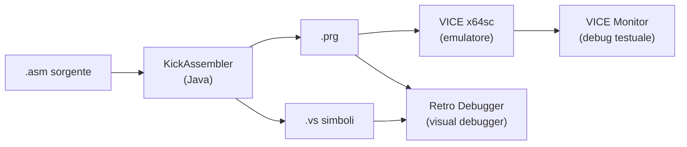
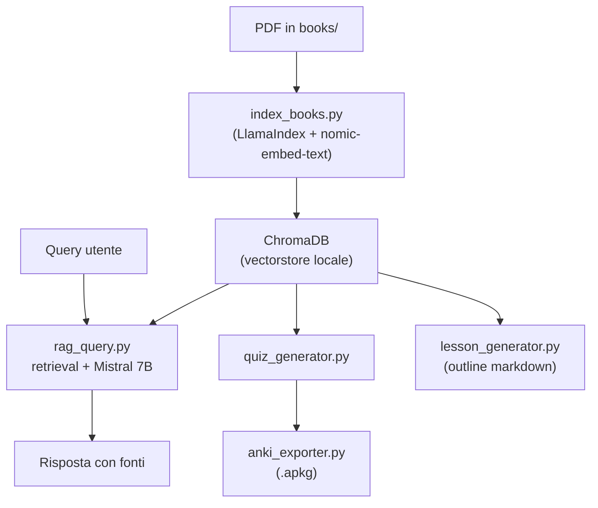

Nei weekend ogni tanto mi torna la voglia di scrivere del codice che fa *beep* e muove dei pixel su uno schermo con quattro colori scelti male. Parliamo del Commodore 64, un computer da 64KB di RAM e un processore a 1 MHz che nel 1982 era lo stato dell'arte e nel 2026 è una palestra eccellente per capire davvero cosa succede dentro una macchina.

Il problema è che nel mezzo ci sono quarant'anni di abitudini. Passare da un editor moderno, con autocomplete, syntax check, task runner e CI/CD, a un workflow da anni '80 fatto di BASIC loader scritti a mano e compilatori invocati da riga di comando con opzioni misteriose... non è esattamente un'esperienza rilassante.

Allora ho deciso di non fare questa scelta. Ho costruito un ambiente di sviluppo che tiene insieme il meglio dei due mondi: la toolchain autentica del C64 — , ,  — dentro un workspace VS Code con multi-root folders, task runner, snippet, Docker e GitHub Actions. Con in cima, per i momenti di studio, un assistente RAG locale che risponde a domande sui miei PDF retro.

Il risultato si chiama **c64devbox**. Questo articolo lo racconta dall'interno.

---

## Perché il C64 nel 2026

Prima di parlare di toolchain, due parole sul *perché*. Il 6502 di MOS Technology è un processore magnificamente semplice: 56 istruzioni, 3 registri general-purpose da 8 bit (A, X, Y), uno stack fisso a $0100-$01FF, indirizzi a 16 bit. Non c'è cache, non c'è pipeline, non c'è branch predictor. Quello che scrivi è quello che esegue, ciclo per ciclo.

Programmare in 6502 assembly su C64 oggi è come fare : non perché serva in produzione, ma perché tiene affilati i riflessi fondamentali. Gestione della memoria manuale, ottimizzazione a colpi di cicli macchina, comprensione profonda delle interrupt. Ogni gioco degli anni '80 era un capolavoro di ingegneria con i vincoli.

In più, c'è qualcosa di soddisfacente nel vedere un `.prg` di 8KB girare su VICE e sapere che girerebbe identico sull'hardware originale.

---

## La struttura del workspace

Il workspace è organizzato come un monorepo con cartelle distinte per responsabilità:

```
c64dev/
├── lessons/        ← lezioni e esercizi (una cartella per lezione)
│   └── shared/     ← libreria condivisa (constants, macros)
├── projects/       ← progetti gioco
├── study/          ← study assistant AI
├── scripts/        ← bootstrap, new-project, asset pipeline
├── templates/      ← template cookiecutter per nuovi giochi
├── tools/          ← KickAssembler, RetroDebugger, GoatTracker, VChar64
├── tutorials/      ← riferimenti e librerie di terze parti
└── books/          ← PDF di riferimento
```

In VS Code si apre come workspace multi-root con `c64dev.code-workspace`: ogni cartella principale ha un nome leggibile con emoji (📚 Lessons, 🎮 Projects, 🧠 Study Assistant...) e le sue task, settings e snippet dedicati. L'effetto è di avere più "progettini" correlati nello stesso ambiente senza che si pestino i piedi.

---

## La toolchain: KickAssembler + VICE

Il cuore dell'ambiente è , un assembler 6502 scritto in Java che supporta macro potenti, namespace, cicli e condizionali a compile time, e una sintassi pulita che lo rende quasi piacevole da usare. È l'assembler de-facto della scena C64 moderna.

Il flusso di build parte da un `KickAss.cfg` con percorsi relativi:

```
-libdir src/lib
-libdir src/data
-showmem
-vicesymbols
-symbolfiledir build
```

L'output è un file `.prg` (il formato eseguibile del C64), un file `.vs` (simboli per il debugger) e un `.dbg` per Retro Debugger. Da lì, tre possibilità:

- **VICE** (`x64sc`): emulatore cycle-accurate, avvio diretto con `-autostartprgmode 1 -autostart`
- **VICE monitor** (`-remotemonitor`): debug da riga di comando in stile anni '80, con breakpoint, dump memoria e disassembler
- **Retro Debugger**: visual debugger con vista memoria, registri, stack, sprite e bitmap in tempo reale



---

## Il sistema delle lezioni: zero rename

Una delle prime seccature quando si lavora con più file `.asm` in VS Code è che le estensioni KickAssembler si aspettano un file di entry point configurato. Ogni volta che cambi lezione, dovresti aggiornare il setting `kickassembler.startup`. Fastidio.

La soluzione è spostare la logica nel Makefile e usare `${fileDirname}` come cwd nelle task VS Code. Il file `.vscode/tasks.json` delle lezioni ha un task default così:

```json
{
  "label": "C64: Build Current Lesson",
  "type": "shell",
  "command": "make",
  "args": ["-C", "${fileDirname}", "build"],
  "group": { "kind": "build", "isDefault": true }
}
```

Ogni lezione ha la sua cartella (`lesson01/`, `lesson03/`, ...) con un `Makefile` di una riga:

```makefile
include ../Makefile.shared
```

E `Makefile.shared` ricava il nome della lezione da `$(notdir $(CURDIR))`, assembla e produce il `.prg` giusto. Il risultato è che aprire qualsiasi `.asm` e premere **Ctrl+Shift+B** compila automaticamente la lezione corrente, senza rinominare nulla e senza toccare i settings.

Da terminale, dal root del workspace, funziona anche così:

```bash
make -C lessons lesson01-run   # build + VICE per lesson01
make -C lessons all-lessons    # compila tutto
```

La libreria condivisa in `lessons/shared/` (mappa completa VIC-II, CIA, macro `SetRasterIrq`, `PrintAt`, ...) è disponibile automaticamente in ogni lezione tramite `-libdir` in KickAss.cfg.

---

## Il template cookiecutter per i giochi

Quando voglio iniziare un nuovo progetto gioco, non voglio ri-creare a mano ogni volta la struttura di cartelle, il Makefile, il KickAss.cfg e i file `.vscode/`. Ho quindi costruito un template  in `templates/game-project/`.

```bash
bash scripts/new-project.sh "Space Invaders"
```

Il wizard chiede sei parametri: nome, slug (auto-generato), autore, descrizione, indirizzo di caricamento in RAM, percorso VICE. In trenta secondi si ha una cartella `projects/space_invaders/` con tutto pre-configurato: Makefile completo con asset pipeline, KickAss.cfg, `.vscode/tasks.json` con gli otto task VICE, scheletro main.asm con Basic loader già scritto.

L'asset pipeline nel Makefile merita una menzione. Copre tutto il ciclo:

```bash
make sprite-import FILE=ship.png LABEL=sprite_ship  # PNG → dati ASM sprite
make bitmap-hires  FILE=bg.png OUT=build/screen      # PNG → hires bitmap C64
make bitmap-koala  FILE=bg.png OUT=build/screen.kla  # → formato Koala Painter
make sid-import    FILE=music.sid                    # copia .sid in assets
make disk TITLE="SPACE INVADERS"                     # crea immagine D64
make exo-sfx OUT=build/packed.prg                    # comprimi con Exomizer
```

---

## Build headless + CI/CD

Per il build headless (e per non sentirmi in colpa se lavoro solo su macOS) c'è un `Dockerfile.dev` basato su `ubuntu:22.04` che installa Java 17 headless, Python 3, Pillow ed Exomizer. KickAss.jar viene copiato nell'immagine. VICE non serve: il CI builda solo, non esegue.

```bash
docker build -f Dockerfile.dev -t c64dev-build .

docker run --rm -v "$(pwd):/workspace" c64dev-build \
    make -C /workspace/lessons all-lessons
```

Il workflow GitHub Actions su `.github/workflows/build.yml` fa tre cose: costruisce l'immagine Docker, assembla tutte le lezioni, assembla tutti i progetti in `projects/`. I file `.prg` vengono caricati come artefatti con retention di 30 giorni. Non è che pubblico release del C64 su npm, ma è comodo avere una green flag sul repo e gli artefatti disponibili.

---

## Lo Study Assistant: RAG sui libri C64

Questa è la parte che mi diverte di più. Ho una raccolta di PDF retro — manuali C64, libri sul 6502, documentazione VIC-II — e invece di aprirli, scorrere, cercare con Ctrl+F e sperare, ho costruito un sistema di  completamente locale.

Lo stack è:

- ****: serve i modelli LLM localmente (niente API key, niente cloud)
- **Mistral 7B**: il modello per le risposte
- **nomic-embed-text**: il modello per gli embedding
- **ChromaDB**: vector store persistente
- **LlamaIndex**: orchestrazione del pipeline RAG
- **Streamlit**: UI web a cinque tab



Il flusso di setup è:

```bash
cd study
make setup         # installa dipendenze Python in .venv
make index-books   # indicizza tutti i PDF (prima volta: ~10 min)
make run-app       # avvia Streamlit su http://localhost:8501
```

L'interfaccia Streamlit ha cinque tab:

- **🔍 RAG Query** — domande in linguaggio naturale con citazione delle fonti
- **📝 Lesson Planner** — genera un outline strutturato (titolo, obiettivi, sezioni, hint ASM) da un topic
- **🎯 Quiz Generator** — crea quiz multiple-choice interattivi
- **🃏 Anki Decks** — esporta qualsiasi quiz come `.apkg` pronto per Anki
- **📊 Index Status** — stato dell'indicizzazione, libri presenti, comandi utili

Da CLI senza UI:

```bash
make query Q="come funziona il raster interrupt sul C64?"
make gen-quiz TOPIC="VIC-II sprites" N=10
make gen-lesson TOPIC="6502 addressing modes"
make export-anki
```

Tutto gira in locale, su M2 con Ollama. Nessun dato esce dalla macchina. Il tempo di risposta per una query RAG è sui 3-8 secondi dipende dal topic.

---

## I dettagli che fanno la differenza

Alcune cose che sembrano piccole ma che dopo due settimane di uso si rivelano essenziali:

**Snippet KickAssembler**: sette snippet nel `.vscode/c64dev.code-snippets` con prefissi `asm-*`. Il più comodo è `asm-rasterirq`, che genera il setup completo del raster interrupt — DisableInterrupts, SetRasterIrq, etichetta ISR con ACK — che altrimenti si trova sempre a riscrivere a memoria con qualche registro sbagliato.

**Settings a livello utente per eliminare i toaster**: le estensioni KickAssembler cercano JDK e il jar all'avvio. Se i percorsi non sono nello user settings.json, VS Code mostra notifiche di errore su ogni workspace che apri. La soluzione è mettere i percorsi assoluti (non `/usr/bin/java` ma il JAVA_HOME completo: `/Library/Java/JavaVirtualMachines/temurin-26.jdk/Contents/Home/bin/java`) direttamente nello user settings, non solo nel workspace.

**bootstrap.sh idempotente**: lo script di setup controlla prima di installare. Java già installato? Skip. VICE già in `/opt/homebrew/bin/x64sc`? Skip. Cookiecutter già in PATH? Skip. Con il flag `--with-study` installa anche Ollama e scarica i modelli. Si può rieseguire tranquillamente dopo aggiornamenti senza paura di rompere qualcosa.

---

## Quello che non ho fatto

Ho voluto tenere il workspace snello, quindi alcune cose non ci sono per scelta:

- **Nessun Language Server Protocol custom**: KickAssembler ha già syntax check e jump-to-definition decenti tramite l'estensione VS Code, non serve reinventarlo
- **Nessun emulatore nella Docker image**: VICE ha dipendenze grafiche che renderebbero l'immagine enorme; per il CI serve solo assemblare, non eseguire
- **Nessun sync del vectorstore**: la cartella ChromaDB è gitignored e va ri-indicizzata localmente; non ha senso committare gigabyte di embedding vettoriali

---

## Per concludere

Quello che mi piace di questo setup è che non è un compromesso: è assembly 6502 vero, con la toolchain che usa la scena C64 moderna, dentro un ambiente che non mi fa sentire di aver rinunciato a nulla. Autocomplete, task runner, CI/CD, Docker build, un assistente AI che conosce i miei libri.

Il Commodore 64 è un computer del 1982. Il workflow per svilupparci sopra può tranquillamente essere del 2026.

Il repository è su GitHub: [theclue/c64dev](https://github.com/theclue/c64dev) — pull request e segnalazioni di bug da chicchessia felicemente accettate.

<!-- TODO: aggiungere immagine screenshot del workspace VS Code con lezione aperta -->
<!-- TODO: aggiungere immagine dell'app Streamlit study assistant -->
<!-- TODO: aggiungere master image: c64devbox-workspace-screenshot.png -->
