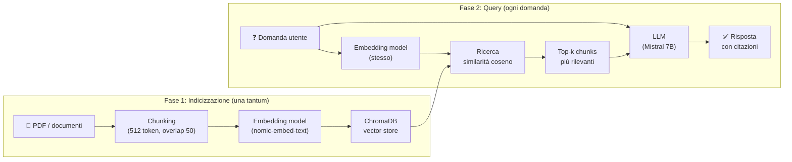
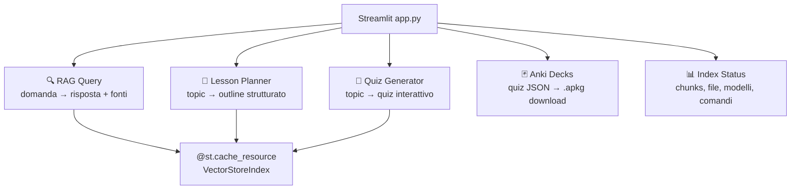

Probabilmente avete un cimitero di PDF.

Quella cartella `~/Documenti/libri/` o `~/Downloads/da-leggere/` dove finiscono manuali tecnici, paper scaricati da ArXiv, libri di testo comprati con le migliori intenzioni e mai aperti dopo il capitolo tre. Libri su Kubernetes. Libri su Haskell. Libri sul trading algoritmico, sull'analisi statistica, sulla fisica quantistica, sull'assembly 6502.

Il problema non è la mancanza di interesse. È che il modo naturale di "studiare da un PDF" — aprirlo, leggerlo, fare l'evidenziatore, riaprirlo settimane dopo sperando di trovare quella cosa che ricordate vagamente — scala malissimo con una raccolta ampia. E scala ancora peggio col tempo.

Quello che serve è qualcosa che conosce il contenuto di quei libri e può rispondervi in modo contestuale, generare domande per testare la vostra comprensione, creare materiale di ripasso, pianificare un percorso di studio. In pratica: un tutor privato che ha letto tutto quello che voi non avete ancora avuto tempo di leggere.

Questa cosa si può costruire in un pomeriggio, gira completamente in locale su un laptop con M1/M2 o una GPU discreta, e non manda un byte ai server di OpenAI. Si chiama **studybox** e questo articolo mostra come è fatta.

---

## Il problema con le soluzioni ovvie

Prima di arrivare all'architettura, vale la pena capire perché le soluzioni ovvie non funzionano.

**Soluzione ovvia 1: caricare i PDF su ChatGPT/Claude.** Funziona, ma avete appena mandato i vostri documenti su server di terze parti. Se i PDF sono manuali aziendali, paper non pubblicati, documentazione proprietaria, questa è un'opzione che non esiste.

**Soluzione ovvia 2: fine-tuning di un modello sul proprio materiale.** Richiede hardware serio (decine di GB di VRAM), settimane di lavoro, competenze di ML avanzate. Eccessivo per un sistema di studio personale.

**Soluzione ovvia 3: leggere i libri.** Rispettabile, ma non ci siamo qui per discutere di alternative fantascientifiche.

La soluzione pratica si chiama : invece di addestrare il modello sui vostri documenti, al momento della domanda si *recuperano* i pezzi di testo più pertinenti e li si passa al modello come contesto. Il modello non "sa" niente dei vostri libri — li legge ogni volta, selettivamente, al momento del bisogno.

---

## Come funziona il RAG, concettualmente

Il pipeline si divide in due fasi ben distinte.

**Fase 1 — Indicizzazione** (eseguita una volta, o quando arrivano nuovi documenti):

1. I PDF vengono spezzati in chunk di testo (tipicamente 512-1024 token, con overlap)
2. Ogni chunk viene trasformato in un vettore ad alta dimensione da un *embedding model*
3. I vettori vengono salvati in un database vettoriale

**Fase 2 — Query** (eseguita a ogni domanda):

1. La domanda viene trasformata in un vettore con lo stesso embedding model
2. Il database restituisce i `k` chunk il cui vettore è più "vicino" a quello della domanda (similarità coseno)
3. I chunk recuperati + la domanda vengono passati all'LLM come contesto
4. L'LLM formula una risposta basandosi *solo* sul contesto fornito



Il punto chiave è che l'embedding model e l'LLM sono due cose diverse con ruoli diversi. L'embedding model è leggero, veloce, deterministico: trasforma testo in vettori. L'LLM è pesante e generativo: formula risposte. Tenerli separati permette di ottimizzarli indipendentemente.

---

## Lo stack tecnologico

Tutto gira in locale. Nessun account richiesto, nessuna API key.

| Componente | Strumento | Ruolo |
|-----------|-----------|-------|
| Runtime LLM locale |  | Serve modelli LLM e embedding via API REST |
| LLM per le risposte |  | Genera risposte contestuali |
| Embedding model | `nomic-embed-text` | Trasforma testo in vettori |
| Orchestrazione RAG |  | Gestisce chunking, index, query engine |
| Vector store |  | Salva e interroga gli embedding |
| UI |  | Interfaccia web a tab |
| Export flashcard |  + genanki | Genera deck `.apkg` |

Perché Mistral 7B e non qualcosa di più grande? Perché su M2 con 16GB di RAM gira comodamente, risponde in 3-8 secondi per query, e per il compito — rispondere a domande da un contesto già fornito — è più che sufficiente. Le grandi performance dei modelli da 70B contano di più per ragionamento multi-step o generazione creativa; per RAG il collo di bottiglia è la qualità del retrieval, non la taglia del modello.

Perché ChromaDB e non Qdrant, Weaviate, Milvus? Perché ChromaDB è embedded: gira nel processo Python, non richiede un server separato, la persistenza è una normale cartella su disco. Meno pezzi in movimento.

---

## La struttura del progetto

```
studybox/
├── books/                  ← i vostri PDF (o qualsiasi cartella vogliate)
├── data/
│   ├── vectorstore/        ← ChromaDB (gitignored)
│   ├── index_metadata.json ← info sull'ultimo indexing
│   ├── quizzes/            ← quiz generati in JSON
│   ├── decks/              ← deck Anki (.apkg)
│   └── lessons_generated/  ← outline lezioni (JSON + Markdown)
├── scripts/
│   ├── rag.py              ← modulo condiviso (index, query engine)
│   ├── index_books.py      ← CLI: indicizza i PDF
│   ├── rag_query.py        ← CLI: query diretta con output rich
│   ├── quiz_generator.py   ← CLI: genera quiz multiple-choice
│   ├── lesson_generator.py ← CLI: genera outline di una lezione
│   └── anki_exporter.py    ← CLI: esporta quiz come deck Anki
├── app.py                  ← UI Streamlit
├── Makefile                ← comandi rapidi
└── requirements.txt
```

La separazione tra script CLI e UI Streamlit è deliberata: si può usare il sistema interamente da terminale, integrarlo in automazioni o task runner, senza dipendere dall'interfaccia grafica.

---

## Il modulo core: configurazione e index

Il modulo `rag.py` tiene tutta la logica condivisa. La parte più importante è la configurazione di LlamaIndex per puntare a Ollama invece che a OpenAI:

```python
from llama_index.core import Settings
from llama_index.llms.ollama import Ollama
from llama_index.embeddings.ollama import OllamaEmbedding

def configure_settings(
    llm_model: str = "mistral",
    embed_model: str = "nomic-embed-text",
    base_url: str = "http://localhost:11434",
    request_timeout: float = 120.0,
):
    Settings.llm = Ollama(
        model=llm_model,
        base_url=base_url,
        request_timeout=request_timeout,
    )
    Settings.embed_model = OllamaEmbedding(
        model_name=embed_model,
        base_url=base_url,
        request_timeout=request_timeout,
    )
```

LlamaIndex gestisce per default gli embedding con OpenAI. Basta sovrascrivere `Settings.llm` e `Settings.embed_model` e tutto il pipeline — chunking, indicizzazione, query — usa automaticamente Ollama.

Il caricamento dell'indice da ChromaDB:

```python
import chromadb
from llama_index.vector_stores.chroma import ChromaVectorStore
from llama_index.core import VectorStoreIndex, StorageContext

def load_index(chroma_path: str, collection: str = "studybox") -> VectorStoreIndex:
    configure_settings()
    client = chromadb.PersistentClient(path=chroma_path)
    collection = client.get_or_create_collection(collection)
    vector_store = ChromaVectorStore(chroma_collection=collection)
    storage_context = StorageContext.from_defaults(vector_store=vector_store)
    return VectorStoreIndex.from_vector_store(
        vector_store, storage_context=storage_context
    )
```

---

## Indicizzare i documenti

`index_books.py` usa il `SimpleDirectoryReader` di LlamaIndex che sa leggere PDF, Word, Markdown, testo puro e molti altri formati:

```python
from llama_index.core import SimpleDirectoryReader, VectorStoreIndex

reader = SimpleDirectoryReader(
    input_dir=books_dir,
    required_exts=[".pdf", ".txt", ".md"],
    recursive=True,
)
documents = reader.load_data()

# Indicizzazione: chunking + embedding + salvataggio su ChromaDB
index = VectorStoreIndex.from_documents(
    documents,
    storage_context=storage_context,
    show_progress=True,
)
```

La prima indicizzazione è l'operazione più lenta: dipende dal numero di PDF, dalla loro dimensione e dalla velocità del modello di embedding. Su un M2 con una raccolta di 10-15 PDF tecnici (tot. ~800 pagine) ci vogliono circa 8-12 minuti. Le indicizzazioni successive sono incrementali — o si può forzare il rebuild completo con `--force`.

Dopo l'indicizzazione, un file `index_metadata.json` registra quanti chunk sono stati generati, quali file sono stati indicizzati e con quali modelli. Utile per capire quando l'indice è "stantio" rispetto ai documenti presenti.

---

## La query e il retrieval

Una volta che l'indice esiste, la query è sorprendentemente semplice:

```python
query_engine = index.as_query_engine(
    similarity_top_k=6,
    response_mode="compact",
)
response = query_engine.query("Come funziona il garbage collector in Go?")

print(response)
# → Il garbage collector di Go utilizza un algoritmo tri-color mark-and-sweep
#   concorrente. [...]
#   Fonti: effective_go.pdf (p. 47), go-memory-model.pdf (p. 12)
```

Il `response_mode="compact"` è quello che di solito funziona meglio per domande da studio: LlamaIndex assembla i chunk recuperati in un contesto unico e chiede all'LLM di rispondere in modo sintetico. Le alternative (`refine` — più lento ma più accurato, `tree_summarize` — per riassunti gerarchici) sono utili per domande su argomenti molto distribuiti nel testo.

La cosa più utile dell'oggetto `response` sono i `source_nodes`: ogni nodo contiene il testo del chunk, il file di provenienza e uno score di rilevanza. Questo permette di citare le fonti con precisione, o di mostrare all'utente da dove viene l'informazione.

---

## Generare quiz (e perché funziona meglio di quanto sembri)

La generazione di quiz è la funzionalità che mi ha sorpreso di più. L'idea è semplice: si recuperano i chunk più rilevanti per un topic, li si passa all'LLM con un prompt che richiede output JSON, e si ottengono domande multiple-choice.

Il prompt è la parte critica:

```python
QUIZ_PROMPT = """
Sei un esperto docente universitario. Basandoti ESCLUSIVAMENTE sul testo fornito,
genera {count} domande a risposta multipla per testare la comprensione profonda
dell'argomento: {topic}.

Regole:
- Ogni domanda deve avere esattamente 4 opzioni
- Una sola opzione è corretta
- Le opzioni errate devono essere plausibili (non ovviamente sbagliate)
- Includi una spiegazione concisa del perché la risposta è corretta
- Le domande devono testare la comprensione, non la memorizzazione

Output SOLO in JSON valido, nessun testo prima o dopo:
[
  {{
    "question": "...",
    "options": ["A", "B", "C", "D"],
    "correct_idx": 0,
    "explanation": "..."
  }}
]

Testo di riferimento:
{context}
"""
```

Il punto "le opzioni errate devono essere plausibili" è quello che distingue un quiz utile da un quiz spazzatura. Un LLM come Mistral è bravo a generare distractors credibili — alternative che sembrano corrette a chi ha capito superficialmente ma non a chi ha capito davvero.

```bash
python scripts/quiz_generator.py \
    --topic "garbage collection in Go" \
    --count 8
```

L'output è un JSON con le domande, salvato in `data/quizzes/`. Da lì si può aprire nell'interfaccia Streamlit per rispondere interattivamente, o esportare direttamente in Anki.

---

## Da JSON ad Anki in trenta secondi

 è il sistema di ripasso con spaced repetition più usato al mondo. Un deck Anki ben costruito è probabilmente lo strumento più efficace che esiste per consolidare conoscenza tecnica nel lungo periodo.

Il problema è che costruire un deck Anki a mano è noioso. Costruirlo automaticamente da un quiz JSON con `genanki` non lo è:

```python
import genanki, hashlib, json

def create_deck(questions: list[dict], deck_name: str) -> genanki.Deck:
    # ID deterministici basati sul nome del deck (no duplicati a ogni export)
    deck_id = int(hashlib.md5(deck_name.encode()).hexdigest()[:8], 16)
    model_id = int(hashlib.md5(f"model_{deck_name}".encode()).hexdigest()[:8], 16)

    model = genanki.Model(
        model_id,
        "StudyBox Q&A",
        fields=[
            {"name": "Question"},
            {"name": "Options"},
            {"name": "Answer"},
            {"name": "Explanation"},
        ],
        templates=[{
            "name": "Card",
            "qfmt": "<b>{{Question}}</b><br><br>{{Options}}",
            "afmt": "{{FrontSide}}<hr>✅ <b>{{Answer}}</b><br><br>{{Explanation}}",
        }],
    )

    deck = genanki.Deck(deck_id, deck_name)
    for q in questions:
        options_html = "<ul>" + "".join(
            f"<li>{opt}</li>" for opt in q["options"]
        ) + "</ul>"
        note = genanki.Note(
            model=model,
            fields=[
                q["question"],
                options_html,
                q["options"][q["correct_idx"]],
                q.get("explanation", ""),
            ],
            tags=["studybox", deck_name.replace(" ", "_").lower()],
        )
        deck.add_note(note)

    return deck
```

L'uso degli ID deterministici è importante: se esportate lo stesso deck due volte, Anki riconosce le carte già esistenti invece di duplicarle.

---

## La pianificazione delle lezioni

La generazione dell'outline di una lezione usa la stessa logica del quiz, con un prompt diverso che richiede struttura JSON più ricca: titolo, obiettivi di apprendimento, prerequisiti, sezioni con concetti chiave e hint per esempi di codice, durata stimata.

```python
LESSON_OUTLINE_PROMPT = """
Sei un instructional designer esperto. Basandoti sul testo fornito, crea un
outline strutturato per una lezione autonoma sull'argomento: {topic}.

Output in JSON:
{{
  "title": "...",
  "learning_objectives": ["al termine lo studente sarà in grado di...", ...],
  "prerequisites": ["conoscenza di...", ...],
  "sections": [
    {{
      "title": "...",
      "summary": "...",
      "key_concepts": ["...", ...],
      "example_hint": "Mostrare un esempio pratico di ..."
    }}
  ],
  "estimated_duration_minutes": 45,
  "source_books": ["nome_libro.pdf", ...]
}}
"""
```

L'output JSON viene poi convertito in un file Markdown con heading, elenchi puntati e blocchi di codice segnaposto. Non è una lezione finita — è una traccia che riduce l'attrito quando si siede a scrivere.

---

## L'interfaccia Streamlit

Tutto questo è accessibile anche da un'interfaccia web a cinque tab costruita con Streamlit. La scelta di Streamlit ha una motivazione precisa: è l'unico framework Python che permette di prototipare una UI a tab con sidebar, widget interattivi e gestione di stato in qualche centinaio di righe, senza toccare HTML/CSS/JS.

Il pattern fondamentale è il caching dell'indice con `@st.cache_resource`:

```python
@st.cache_resource(show_spinner="Caricamento indice...")
def get_index():
    return load_index(VECTORSTORE_PATH)
```

Senza questo decorator, ogni interazione ricaricherebbe l'indice da disco e re-inizializzerebbe la connessione a ChromaDB. Con il caching, il caricamento avviene una volta sola per sessione.



---

## Come adattarlo ai propri documenti

L'architettura è indipendente dal dominio. Ho costruito la mia studybox per libri di informatica retro, ma funziona identicamente con:

- **Documentazione tecnica** (API docs, RFC, specifiche): indicizzate e interrogabili
- **Libri di testo universitari**: ottimo per generare quiz di preparazione agli esami
- **Paper accademici** (ArXiv, PubMed): riassunti e domande su concetti specifici
- **Note personali e Obsidian vault** (se esportati in Markdown): knowledge base personale interrogabile
- **Manuali d'uso aziendali**: onboarding più rapido per chi arriva in un nuovo team

L'unico requisito è che i documenti esistano in formato che `SimpleDirectoryReader` sa leggere. Per i PDF scansionati (immagini, non testo selezionabile) serve un passo OCR aggiuntivo prima dell'indicizzazione — fuori scope qui, ma non è un problema irrisolvibile.

---

## I limiti da tenere a mente

Il RAG non è una soluzione magica. Alcuni problemi reali:

**La qualità del retrieval dipende dalla qualità del chunking.** Se un concetto è distribuito su più capitoli non consecutivi, la similarità semantica potrebbe non recuperare tutti i pezzi necessari per una risposta completa. Il parametro `similarity_top_k` è un trade-off: più alto dà più contesto ma aumenta il rischio di "rumore" nel prompt.

**L'LLM può allucinare anche con il contesto.** Il RAG riduce drasticamente le allucinazioni (l'LLM ha il testo davanti), ma non le elimina. Per argomenti tecnici dove la precisione conta, le citazioni delle fonti nei `source_nodes` sono essenziali: verificate sempre.

**I modelli da 7B hanno limiti di ragionamento.** Per domande che richiedono di connettere concetti da capitoli distanti, o di fare inferenze complesse, un modello più grande (13B, 34B) o un `response_mode="refine"` con più passaggi danno risultati migliori — al costo di latenza più alta.

**La prima indicizzazione richiede che Ollama stia girando.** Non è un server sempre-on: si avvia con `ollama serve`, si usa, si spegne. Ci vuole un po' di disciplina nel workflow.

---

## Per concludere

La studybox non è uno strumento sofisticato. È tre idee semplici messe insieme: i documenti diventano vettori, la domanda diventa un vettore, si trovano i documenti più vicini e si chiede a un LLM di rispondere. Il tutto in locale, con strumenti open source, su hardware consumer.

Quello che la rende utile è la combinazione dei moduli: non solo risponde alle domande, ma genera quiz, crea deck Anki, pianifica lezioni. È la differenza tra un motore di ricerca semantico e un sistema di studio.

Il codice del prototipo che ho usato per la mia raccolta di libri retro è disponibile nel repository [theclue/c64dev](https://github.com/theclue/c64dev) nella cartella `study/` — abbastanza generico da poter essere estratto e riciclato su qualsiasi raccolta di documenti con poche modifiche.

Se avete un cimitero di PDF che volete resuscitare, ora sapete da dove cominciare.

<!-- TODO: aggiungere screenshot dell'interfaccia Streamlit con una query di esempio -->
<!-- TODO: aggiungere immagine master: studybox-rag-local-ai.png -->
<!-- TODO: considerare se aggiungere sezione su come fare OCR dei PDF scansionati -->
