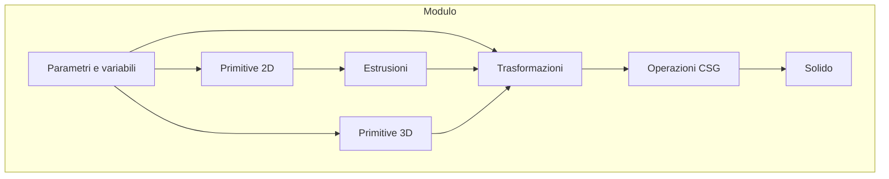

Se avete mai usato il Customizer di Thingiverse, conoscete già il principio: un modello 3D non è un oggetto statico, ma un insieme di parametri che potete regolare con degli slider per adattarlo alle vostre esigenze. Quello che il Customizer fa dietro le quinte è eseguire un programma scritto in **OpenSCAD**, un linguaggio di programmazione per la modellazione solida che descrive la geometria invece di disegnarla.

OpenSCAD è uno strumento che, in effetti, agli inizi può intimidire non poco: l'idea di costruire un solido (o un assieme) a partire da primitive definite con un linguaggio di programmazione, quindi tutto a codice suona una cosa davvero _da pazzi_, soprattutto se lì fuori ci sono Fusion 360 e Blender — tanto per citare un paio di pezzi grossi. Ma ci sono almeno tre buoni motivi per abbracciare questa dose di follia:

1. È incredibilmente elegante e soddisfacente.
2. Si impara tantissimo sulla geometria solida.
3. Essendo tutto a codice, i moderni LLM possono dare una gran mano sia nella generazione ma (soprattutto) nel debugging e nella parametrizzazione di un solido.

In questa serie di tre articoli vi accompagno nella realizzazione di un progetto completo: un **passacavo parametrico da scrivania** con attacco a baionetta. L'oggetto finale è composto da tre pezzi — un manicotto superiore con flangia, un anello inferiore con innesto a baionetta e un tappo con apertura parabolica — e si adatta parametricamente al diametro del foro e allo spessore del piano.

In questa prima parte ci concentreremo sul linguaggio: sintassi, primitive, trasformazioni e organizzazione del codice. Useremo il passacavo come esempio concreto per ogni concetto, ma l'obiettivo è darvi le basi per scrivere (o leggere) qualsiasi file `.scad`.

---

## La sintassi di OpenSCAD in dieci minuti

OpenSCAD non è un linguaggio _general-purpose_ come Python o JavaScript, o comunque non è un linguaggio imperativo: è un linguaggio di **descrizione geometrica** di tipo . C'è un insieme ridotto di costrutti, tutti orientati a un unico scopo: costruire solidi.

Ecco le regole fondamentali, quelle che incontrerete in ogni file `.scad`:

**Terminatore.** Ogni istruzione termina con un punto e virgola `;`. Dimenticarlo è l'errore più comune (e più frustrante) per un principiante.

```openscad
cube([10, 20, 5]);   // corretto
cube([10, 20, 5])    // ERRORE: manca il ;
```

**Commenti.** Come in C e JavaScript: `//` per una riga, `/* ... */` per blocchi. OpenSCAD usa i commenti anche per istruzioni speciali destinate al Customizer (ci arriviamo).

```openscad
// Questo è un commento su una riga

/* Questo è un commento
   su più righe */
```

**Variabili.** Si assegnano con `=`. Per la , una volta assegnate, sono immutabili: non potete riassegnarle nello stesso scope. Questo confonde chi viene da linguaggi imperativi, il cui concetto equivalente è quello della *costante* ma ha una logica: in un modello parametrico, ogni grandezza ha _un solo valore_ in un dato contesto.

```openscad
hole_dia = 60;           // numero
wall = 3.0;              // numero decimale
material = "PLA";        // stringa (rara, ma esiste)
```

**Vettori.** Le coordinate e le dimensioni sono vettori tra parentesi quadre. Un punto nello spazio è `[x, y, z]`, una dimensione è `[larghezza, profondità, altezza]`.

```openscad
[0, 0, 10]          // punto: x=0, y=0, z=10
[20, 30, 5]         // cuboide: 20×30×5
```

**Moduli.** Sono l'equivalente delle funzioni in altri linguaggi. Si definiscono con `module nome(parametri) { ... }` e si richiamano per nome. Sono il mattone fondamentale per organizzare il codice.

```openscad
module my_peg(h, d) {
    cylinder(h = h, d = d);
}

my_peg(10, 5);   // richiamo il modulo
```

In realtà, il costrutto dei linguaggi imperativi più vicino al concetto di modulo è quello delle _procedure_: come queste ultime, infatti, non è previsto un valore di ritorno (che, invece, è sempre previsto nelle funzioni, che sia anche _void_ o _NULL_). Proviamo a linearizzare la struttura, solo per farci uno schema mentale:



**Ordine dei comandi — la notazione prefissa.** Attenzione! In OpenSCAD, trasformazioni, estrusioni e operazioni CSG si scrivono _prima_ dell'oggetto (o del blocco) a cui si applicano:

```openscad
translate([10, 0, 0])   // ← modificatore (padre)
    cube([5, 5, 5]);    // ← oggetto modificato (figlio)
```

`cube` è il _figlio_ di `translate`. Il modificatore si applica solo all'oggetto immediatamente successivo. Se dovete applicarlo a più oggetti, li racchiudete tra parentesi graffe:

```openscad
translate([10, 0, 0]) {   // si applica a tutto il blocco
    cube([5, 5, 5]);
    cylinder(h = 3, d = 8);
}
```

L'indentazione non è obbligatoria ma è una convenzione universale per mostrare la gerarchia padre-figlio. Questa sintassi — chiamata _prefix notation_ — è il fondamento di tutto OpenSCAD: la incontrerete in ogni trasformazione, estrusione, operazione booleana. Impararne la logica adesso vi eviterà ore di debug su parentesi fuori posto.

**Riepilogo sintattico:**
- `;` — termina ogni istruzione
- `//` e `/* */` — commenti
- `variabile = valore;` — assegnazione (immutabile)
- `[a, b, c]` — vettore (punto o dimensione)
- `module nome(...) { ... }` — definizione di modulo
- `nome(...);` — richiamo di modulo

Con queste sei regole avete già abbastanza per leggere la struttura di qualsiasi file OpenSCAD. Ora vediamo _cosa_ potete costruirci.

---

## Primitive 3D

Tutto ciò che viene creato in OpenSCAD parte da un insieme di forme elementari chiamate **primitive**. Sono poche, ma combinandole con le operazioni booleane che vedremo dopo, è possibile costruire qualsiasi geometria.

**`cube([w, d, h])`** — un parallelepipedo. Se passate un singolo numero (`cube(5)`) ottenete un cubo. Con il parametro `center = true` il cubo è centrato nell'origine invece che appoggiato sul piano XY.

```openscad
cube([20, 30, 5]);              // 20×30×5, appoggiato su Z=0
cube([10, 10, 10], center=true); // 10×10×10, centrato nell'origine
```



**`sphere(r)` o `sphere(d)`** — una sfera di raggio `r` (o diametro `d`). Con `$fn` controllate il numero minimo di segmenti del solido: valori bassi danno un poliedro, valori alti una sfera liscia. `$fn = 6` produce un cubo! Il parametro `$fa` (minimum angle) è un'alternativa più elegante quando non volete hardcodare la risoluzione.

```openscad
sphere(r = 10);         // sfera di raggio 10 mm
sphere(d = 20, $fn=64); // sfera liscia di diametro 20 mm
```



**`cylinder(h, r)` o `cylinder(h, d)`** — un cilindro di altezza `h`. `r1` e `r2` (o `d1` e `d2`) diversi tra loro producono un tronco di cono. Anche qui `$fn` controlla la risoluzione del cerchio di base.

```openscad
cylinder(h = 15, d = 10);                  // cilindro
cylinder(h = 5, d1 = 10, d2 = 6);         // tronco di cono
cylinder(h = 25, d = 60, $fn = 128);      // cilindro liscio
```



**Riepilogo primitive 3D:**
- `cube([w, d, h])` o `cube(size, center)`
- `sphere(r)` o `sphere(d)` — risoluzione via `$fn` o `$fa`
- `cylinder(h, r)` o `cylinder(h, d, r1, r2)` — risoluzione via `$fn` o `$fa`
- `polyhedron(points, faces)` — per geometrie arbitrarie (avanzato)

---

## Primitive 2D: le forme piatte

OpenSCAD ha anche primitive bidimensionali. Da sole non servono a molto — ma quando le combinate con `linear_extrude()` o `rotate_extrude()`, diventano la base per dei solidi 3D arbitrariamente complessi.

**`square([w, h])`** — un rettangolo. Con `center = true` è centrato nell'origine.

```openscad
square([20, 10]);         // rettangolo 20×10
square(5, center = true); // quadrato 5×5 centrato
```

**`circle(r)` o `circle(d)`** — un cerchio. Stessa logica di `$fn` della sfera e del cilindro.

```openscad
circle(r = 10, $fn = 64); // cerchio liscio
```

**`polygon(points)`** — un poligono arbitrario definito da una lista di punti.

```openscad
polygon([[0,0], [10,0], [5,10]]); // triangolo
```

**Riepilogo primitive 2D comuni:**
- `square([w, h])` o `square(size, center)`
- `circle(r)` o `circle(d)` — risoluzione via `$fn`
- `polygon(points)` — poligono arbitrario
- `text("...")` — testo

---

## Trasformazioni: spostare, ruotare, scalare

Le primitive da sole producono oggetti centrati nell'origine. Per costruire un assieme, dovete spostarle, ruotarle, ridimensionarle. Le trasformazioni si applicano a _tutto_ ciò che sta dentro le parentesi graffe che le seguono.

**`translate([x, y, z])`** — traslazione. Sposta l'oggetto nello spazio.

```openscad
translate([10, 0, 0])
    cube([5, 5, 5]);   // cubo spostato di 10 mm sull'asse X
```

**`rotate([x, y, z])`** — rotazione. Gli angoli sono in gradi, applicati nell'ordine X → Y → Z. Una `rotate([0, 0, 45])` ruota di 45° attorno all'asse Z (come un giro sul piano).

```openscad
rotate([0, 0, 45])
    cube([10, 5, 3]);  // ruotato di 45° su Z
```

**`scale([x, y, z])`** — ridimensionamento. Moltiplica le dimensioni per i fattori indicati. `scale([1, 1, 0.5])` schiaccia l'oggetto a metà altezza.

**`mirror([x, y, z])`** — specchiatura. Riflette l'oggetto rispetto al piano passante per l'origine e perpendicolare al vettore dato.

**Riepilogo trasformazioni comuni:**
- `translate([x, y, z])` — traslazione
- `rotate([ax, ay, az])` — rotazione in gradi (ordine X→Y→Z)
- `scale([sx, sy, sz])` — ridimensionamento
- `mirror([nx, ny, nz])` — specchiatura
- `color("nome")` — colore in anteprima (non influisce sulla geometria)
- `resize([w, d, h])` — ridimensiona forzando le dimensioni assolute

---

## Estrusioni: dalla seconda alla terza dimensione

Le primitive 2D da sole non producono oggetti stampabili: sono sagome piatte, senza spessore. Per trasformarle in solidi si usano le **estrusioni**, che sono il ponte tra il mondo 2D e quello 3D.

**`linear_extrude(height)`** — prende una forma 2D e la "tira" verso l'alto per un'altezza `height`, creando un solido prismatico. È l'equivalente dell'operazione di, appunto, estrusione dei CAD parametrici come Fusion 360.

```openscad
linear_extrude(height = 5)
    polygon([[0,0], [10,0], [5,10]]);
```



Con il parametro `twist` potete ruotare la sezione durante l'estrusione, utile ad esempio per creare strutture elicoidali. Notate come anche queste trasformazioni supportano il parametro `$fn`.

`convexity` viene, invece, utilizzato per suggerire a OpenSCAD il profilo di convessità del solido, laddove il CAD non riesca (accade spesso) a risolvere fori e cavità. 10 è un ottimo valore di default con cui iniziare (e spesso non è necessario cambiarlo).

```openscad
linear_extrude(height = 15, convexity = 10, twist = 1440, $fn = 32)
  translate([2, 0, 0])
  circle(r = 1);
```




**`rotate_extrude(angle)`** — prende una forma 2D e la ruota attorno all'asse Z, creando un solido di rivoluzione. Se `angle` è 360°, ottenete un toroide completo; angoli minori producono settori. È uno dei modi per ottenere l'equivalente dell'operazione _revolve_, ovvero solidi di rotazione.

```openscad
rotate_extrude(angle = 180, $fn = 128)
    translate([15, 0, 0])
        square([5, 10]);
```

La `translate([15, 0, 0])` sposta il quadrato lontano dall'asse Z prima della rivoluzione: senza questa traslazione, il solido collasserebbe su sé stesso (ruotando una forma che contiene l'origine si ottiene un cilindro pieno, non un guscio).



Nel progetto del passacavo, `rotate_extrude` è usato, ad esempio, per creare i settori di anello che compongono lo slot a L dell'attacco a baionetta attraverso un modulo riutilizzabile (visto che di scassi ne sono previsti 3, sfalsati di 120°):

```openscad
module ring_sector(r1, r2, h, a) {
    rotate_extrude(angle = a, $fn = 160)
        translate([r1, 0, 0])
            square([r2 - r1, h]);
}
```

Qui `square([r2-r1, h])` è la sezione rettangolare, traslata a distanza `r1` dall'asse, ruotata di `a` gradi. Il risultato è un settore di anello — il mattone con cui costruiremo pin e slot nella seconda parte della serie.

**Riepilogo estrusioni:**
- `linear_extrude(height)` — estrusione lineare (+ `twist`, `scale`, `center`)
- `rotate_extrude(angle)` — estrusione per rivoluzione (+ `$fn` per la risoluzione angolare)

## Operazioni CSG: unite, scavate, intersecate

Ora avete i mattoni e sapete spostarli. Il passo successivo è **combinarli**. Le tre operazioni fondamentali della Constructive Solid Geometry (CSG) sono il cuore di OpenSCAD.

### `union()` — unione

Raggruppa più oggetti in uno solo. È il modo in cui componete un pezzo a partire da primitive distinte. Nel passacavo, il manicotto superiore unisce un cilindro (il corpo tubolare) e un disco (la flangia d'appoggio):

```openscad
union() {
    // Corpo tubolare
    cylinder(h = sleeve_h, d = sleeve_od);
    // Flangia superiore, traslata in cima al manicotto
    translate([0, 0, sleeve_h])
        cylinder(h = top_lip_h, d = top_lip_od);
}
```



Notate come `translate` sposti solo il secondo `cylinder`, non il primo: le trasformazioni dentro `union()` (o qualsiasi altro blocco) si applicano solo agli oggetti che seguono immediatamente, seguendo la _prefix notation_ (per questo motivo delimitare i comandi con `;` è fondamentale!).

### `difference()` — sottrazione

Sottrae uno o più oggetti da un oggetto base. Il primo figlio è il _solido positivo_, tutti i successivi sono _sottratti_. È così che si creano fori, cave, scanalature:

```openscad
difference() {
    // Solido base: manicotto + flangia
    union() {
        cylinder(h = sleeve_h, d = sleeve_od);
        translate([0, 0, sleeve_h])
            cylinder(h = top_lip_h, d = top_lip_od);
    }
    // Foro passante per i cavi (sottratto)
    cylinder(h = sleeve_h + top_lip_h + 4, d = sleeve_id);
}
```



Come potete vedere, il secondo `cylinder` (diametro `sleeve_id`, altezza maggiorata `+ 4`) viene sottratto dal primo, creando un tubo cavo. L'altezza maggiorata garantisce che il foro attraversi completamente entrambi i pezzi senza lasciare superfici complanari — che in OpenSCAD causano artefatti di rendering, specie durante l'esportazione.

Questo pattern — esagerare le dimensioni dell'oggetto da sottrarre in modo che "sbuchi" sempre oltre le superfici. Per gli utenti Fusion 360, dove pure è possibile far così   invece di un `extrude cut` con `to = object` più elegante, è sinonimo di pigrizia. Qui, invece, ci mette al riparo da eventuali complicanze geometriche che sono molto ostiche su OpenSCAD (per via di funzionalità del tutto assenti nel tool di Autodesk).
Essendo il cut incapsulato in una `difference` non c'è, poi, il rischio di tagliare inavvertitamente oggetti che, invece, dovrebberro essere preservati - errore piuttosto comune in Autodesk.

Morale della favola: si estrude _giù fino alle cantine_ e si dorme sereni. Il senso è quello.

### `intersection()` — intersezione

Mantiene solo il volume comune a due o più oggetti.

```openscad
intersection() {
    cube([10, 10, 10]);
    sphere(r = 7);
}
// Risultato: un cubo con gli angoli sferici
```

**Riepilogo operazioni CSG comuni:**
- `union()` — unisce oggetti
- `difference()` — sottrae dal primo oggetto tutti i successivi
- `intersection()` — mantiene solo il volume comune
- `hull()` — crea l'inviluppo convesso tra due o più oggetti
- `minkowski()` — somma di Minkowski (avanzato)

---

## Anatomia di un file OpenSCAD

Ora che avete il vocabolario di base, possiamo guardare come è organizzato il file completo del passacavo (). La struttura che uso sempre, con piccole variazioni, è questa:

1. **Header**: nome, descrizione dei componenti, licenza d'uso, ecc.
2. **Parameter panel**: variabili raggruppate per sezione, con range per il Customizer
3. **Derived geometry**: variabili calcolate che dipendono dai parametri
4. **Helpers**: moduli riutilizzabili di uso generale
5. **Modules**: un modulo per ogni pezzo fisico
6. **Assembly**: composizione dei pezzi
7. **Layout**: switch per modalità di visualizzazione

---

## Il Parameter Panel

La parte più visibile del file, specialmente se lo aprite nel Customizer di Thingiverse, è il pannello dei parametri. In OpenSCAD si scrive così:

```openscad
/* [Hole & Desk] */

// Diameter of the hole in the desk panel (mm)
hole_dia = 60; // [40:1:120]

// Thickness of the desk panel (mm)
desk_thickness = 25; // [10:1:60]
```

Due convenzioni importanti:

- I commenti `/* [Nome Sezione] */` vengono interpretati dal Customizer per creare gruppi di slider nell'interfaccia utente.
- I commenti `// [min:step:max]` dopo una variabile definiscono il range dello slider.

I parametri non sono solo numeri: sono il _contratto_ del modello. Chiunque apra il file sa immediatamente cosa può modificare e entro quali limiti.

Nel passacavo, i parametri sono organizzati in sezioni logiche: `[Hole & Desk]`, `[General Tolerances]`, `[Top Ring]`, `[Bottom Ring]`, `[Bayonet Lock]`, `[Cap Snap-In]`, `[Parabolic Opening]`, `[View]`, `[Render]`.

Per un progetto parametrico ben fatto, la regola è: **ogni numero che potrebbe cambiare deve essere una variabile nel parameter panel**.

---

## Il modello completo: tre pezzi, un assieme

Il passacavo è composto da tre moduli indipendenti:

- **`top_part()`** — il manicotto superiore con flangia d'appoggio. Contiene gli slot a L per la baionetta e la gola per lo snap-fit del tappo.
- **`bottom_part()`** — l'anello inferiore con collare. Sul collare sporgono i pin radiali.
- **`cap_part()`** — il tappo a scatto con apertura parabolica.

Ogni modulo è un pezzo fisico distinto, stampabile indipendentemente. Sono moduli separati proprio per questo: potete esportare solo il `top_part()` se dovete ristampare solo quello.

---

## Organizzare il codice: le regole che uso

Dopo aver scritto parecchi progetti in OpenSCAD, ho consolidato alcune convenzioni:

1. **Un modulo, un pezzo**. `top_part()`, `bottom_part()`, `cap_part()` sono moduli separati.
2. **Niente numeri magici**. `3` non significa niente; `wall = 3.0` con commento `// Sleeve wall thickness` sì.
3. **Tolleranze esplicite**. `clearance`, `bayo_slot_play`, `cap_skirt_clearance` sono variabili dedicate.
4. **Commenti che spiegano il _perché_**. Non `// raggio = 3` ma `// 0.4 mm radial clearance for sliding fit`.
5. **Sezioni marcate con delimitatori**. `// ======` per separare logica, geometria, moduli.

Nelle prossime due parti della serie vedremo la geometria dell'attacco a baionetta e il sistema di modalità di visualizzazione con esportazione per la stampa.
