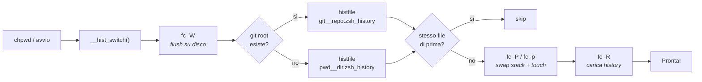

Se lavorate su più progetti contemporaneamente — e chi non lo fa? — vi sarà capitato di premere `Ctrl+R` per ripescare un comando e trovarvi tra i piedi il comando sbagliato. Il `docker compose down` del progetto A che non c'entra niente col progetto B. Il `kubectl` del cluster di staging mentre siete sul cluster di produzione. L'`rsync` verso il server del cliente sbagliato.

Ok forse ho un po' esagerato, magari non parliamo di eventi così catastrofici, però esplosioni termonucleari a parte non è raro perdersi nel cercare nella history della shell quel particolare `configure` pieno zeppo di parametri e ritrovarci ad andare indietro...e indietro...e indietro...insomma, ci siamo capiti.

Per non parlare del _momento-zero_ in cui ci ritroviamo pieni zeppi di schede di terminale aperte e, presi da irrefrenabile rifiuto per il livello di entropia raggiunto dall'Universo, andiamo a premere forsennatamente il famigerato pulsante d'angolo della finestra. Dimenticandoci che il `SIGTERM` non _flusha_ il buffer nell'history file.

Sull'entropia dell'Universo ci stiamo ancora lavorando, ma riguardo l'history della shell qualcosa in più possiamo farla.

Ma qual è il problema?

La history della shell è globale per default. Questo è il problema.

La soluzione più pratica che ho trovato è **separare la history per progetto**, usando come discrimine la _root_ del  in cui vi trovate. Questo perché è abbastanza sano ipotizzare che, se state consumando il pulsante freccia-su sulla tastiera, è perché state sviluppando qualcosa, e quindi con ogni probabilità siete nella root di un repository git. Oppure siete nel bel mezzo di una sessione di .

Tuttavia, se non siete in un repo git, si ripiega sulla directory corrente. Il tutto con poche righe di ZSH.

Il mio script funziona con , ma il concetto è adattabile a qualsiasi shell moderna.

---

## Le opzioni globali

Prima di entrare nel vivo, mettiamo a posto le impostazioni di base della history. Non sono strettamente necessarie per il trucco principale, ma evitano comportamenti fastidiosi. Queste vanno nel vostro `.zshrc`:

```bash
export HISTSIZE=200000
export SAVEHIST=200000

setopt EXTENDED_HISTORY          # registra il timestamp di ogni comando
setopt HIST_IGNORE_ALL_DUPS      # non mettere duplicati nella history
setopt HIST_SAVE_NO_DUPS         # non salvare duplicati su file
setopt HIST_REDUCE_BLANKS        # togli spazi inutili
setopt HIST_IGNORE_SPACE         # ignora comandi che iniziano con spazio
setopt SHARE_HISTORY             # condividi la history tra sessioni aperte
setopt HIST_FCNTL_LOCK           # file locking per evitare corruzione
```

Due parole su `SHARE_HISTORY`: se usate tante sessioni terminale in parallelo (tmux, schede del terminale, etc.), tenetela attiva come sopra. Altrimenti, se preferite che ogni sessione sia isolata finché non la chiudete, sostituitela con `setopt INC_APPEND_HISTORY_TIME`. Io personalmente uso `SHARE_HISTORY` perché mi piace che tutto sia immediatamente disponibile ovunque, ma è questione di gusti.

Riguardo invece `HIST_IGNORE_SPACE` è un trucchetto che uso quando voglio lanciare un comando "in incognito" affinché non lasci traccia nella history. Mi basta aggiungerci un _leading space_. Attenzione che questa opzione ha un  tra ZSH e Bash!

---

## Il cuore: history per progetto

L'idea è semplice: ogni volta che entrate in una directory, controlliamo se fa parte di un repository git. Se sì, la history viene salvata in un file dedicato a quel repo. Altrimenti, si usa la directory corrente come chiave.

Prima di tutto, serve una directory dove conservare i file di history:

```bash
: ${XDG_STATE_HOME:=$HOME/.local/state}
HIST_PROJECT_BASE="$XDG_STATE_HOME/zsh/history"
mkdir -p "$HIST_PROJECT_BASE"
```

Rispettiamo lo standard XDG, e se la variabile non è definita, ripieghiamo su `~/.local/state`.

Poi ci serve una funzione per sanitizzare i path e trasformarli in nomi di file validi:

```bash
__hist_sanitize() {
  print -r -- "${1//\//__}" | tr -cd '[:alnum:]_.-'
}
```

Sostituisce gli slash con doppio underscore e rimuove qualsiasi carattere che non sia alfanumerico, underscore, punto o trattino.

La funzione che individua la root git è banale:

```bash
__project_root() {
  local root
  root="$(command git rev-parse --show-toplevel 2>/dev/null)" && print -r -- "$root"
}
```

Se non siete in un repo git, `git rev-parse` fallisce silenziosamente e la funzione restituisce 1. Il prefisso `command` evita che eventuali alias o funzioni personalizzate interferiscano.

---

## Lo switch: il cambio di history al volo

Più o meno quello che succede è questo:



E questa è la funzione che fa il grosso del lavoro:

```bash
__hist_switch() {
  local key histfile
  key="$(__project_root)" && {
    key="$(__hist_sanitize "$key")"
    histfile="$HIST_PROJECT_BASE/git__${key}.zsh_history"
  } || {
    key="$(__hist_sanitize "$PWD")"
    histfile="$HIST_PROJECT_BASE/pwd__${key}.zsh_history"
  }

  # Già nel progetto giusto? Non fare nulla
  [[ "$histfile" == "$HISTFILE" ]] && return

  fc -W 2>/dev/null             # flush su disco

  # Se lo stack esiste, lo poppiamo; poi pushiamo il nuovo.
  # push+pop in sequenza azzera la history in-memory,
  # evitando che comandi del vecchio progetto inquinino il nuovo file.
  (( __hist_has_stack )) && fc -P 2>/dev/null
  fc -p "$histfile"

  # Se il file non esiste ancora, lo creiamo
  [[ -f "$histfile" ]] || touch "$histfile"
  fc -R 2>/dev/null             # carica la history del progetto

  __hist_has_stack=1
}
```

Quattro cose notevoli:

1. **Guardia `[[ "$histfile" == "$HISTFILE" ]] && return`** evita di fare I/O quando navigate tra sottodirectory dello stesso progetto.
2. **`fc -P` / `fc -p`** gestiscono uno stack di history. La sequenza pop+push azzera la lista in-memory, risolvendo un leak subdolo per cui `fc -R`, in ZSH, **appende** i comandi a quelli già in memoria invece di sostituirli.
3. **`touch "$histfile"`** è necessario perché `fc -W` di ZSH non crea file inesistenti — se il progetto è nuovo di zecca, senza `touch` la prima scrittura andrebbe persa.
4. Il flag `__hist_has_stack` evita di chiamare `fc -P` al primo avvio, quando ancora non c'è uno stack da poppare.

---

## Gli hook

Per far scattare lo switch in automatico, usiamo un hook di ZSH:

```bash
autoload -Uz add-zsh-hook
add-zsh-hook chpwd __hist_switch
typeset -g __hist_has_stack=0
```

L'hook `chpwd` viene eseguito ogni volta che cambiate directory. Un `cd ../altro-progetto` e la history cambia automaticamente. Rabbrividiamo!

Ma serve anche all'avvio di una nuova sessione:

```bash
__hist_switch
```

Così, quando aprite un nuovo terminale, la history giusta è già caricata.

E per sicurezza, salviamo la history anche quando il terminale viene chiuso o interrotto:

```bash
TRAPEXIT() {
  fc -W 2>/dev/null
}

TRAPTERM() {
  fc -W 2>/dev/null
  kill -TERM $$
}
```

Non è strettamente indispensabile perché `fc -W` viene già chiamato a ogni `chpwd`, ma non si sa mai.

---

## Cosa ottenete in pratica

```bash
~ $ ls .local/state/zsh/history/
git____home__gabrio__progetti__mio-blog.zsh_history
git____home__gabrio__progetti__ansible-playbook.zsh_history
pwd____home__gabrio__Downloads.zsh_history
pwd____home__gabrio.zsh_history
```

Ogni progetto ha la sua history, pulita e isolata. Quando siete nella directory del blog, `Ctrl+R` vi mostra solo comandi rilevanti: `bundle exec jekyll serve`, `git commit -m "nuovo post"`, `rsync` verso il server giusto. Quando passate al progetto Ansible, solo `ansible-playbook`, `ansible-vault` e compagnia cantante.

Niente più `docker compose down` sbagliato. Niente più `kubectl delete namespace` sul cluster di produzione.

---

## Un'ultima nota

Questo script è un estratto del mio setup personale, che trovate . Sentitevi liberi di adattarlo, modificarlo, migliorarlo.

Nel frattempo, mano destra sulla tastiera e cominciate a premere che il comando che vi serve rilanciare è proprio lì sopra...su...su...su...su...
